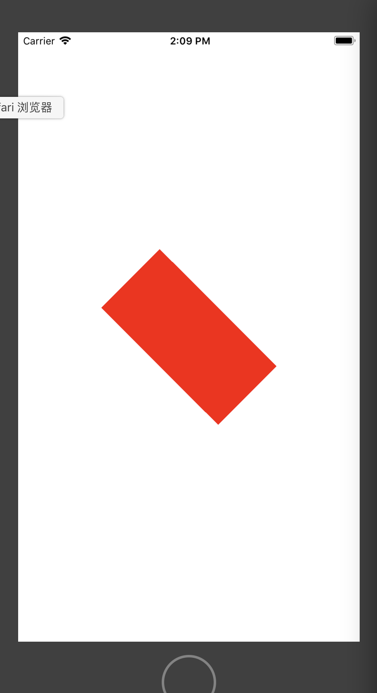

# 视图元素旋转操作

- 执行效果：



- 示例代码：

```
//创建举行
let demoview = UIView(frame: CGRect(x:self.view.bounds.size.width/2-100, y: self.view.bounds.size.height/2-50, width: 200, height: 100));
demoview.backgroundColor = UIColor.red;
self.view.addSubview(demoview);
        
//旋转视图45°操作
demoview.transform = view.transform.rotated(by: 3.14/4);
```

