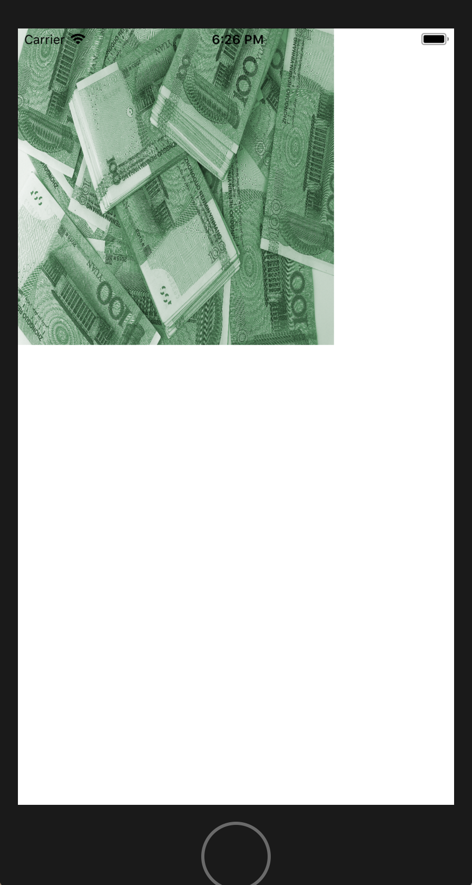

# CoreImage设置图片的单色效果

- 原图：


- 执行效果：



- 实例代码：

```
import CoreImage
    override func viewDidLoad()
    {
        super.viewDidLoad()
        /* 创建图片容器 */
        let myImage = UIImage(named: "3");
        let imageView = UIImageView(image: myImage);
        imageView.frame.size = CGSize(width: 300, height: 300);
        self.view.addSubview(imageView);
        
        //初始化CIImage图像对象
        let ciimage = CIImage(image: myImage!);
        //初始化颜色对象
        //设置滤镜颜色
        let color = CIColor(red: 0.3, green: 0.6, blue: 0.4);
        //初始化滤镜对象，并设置滤镜类型为单色调滤镜
        let filter = CIFilter(name: "CIColorMonochrome");
        //设置单色调滤镜的输入颜色值
        filter?.setValue(color, forKey: kCIInputColorKey);
        //设置单色调滤镜的颜色浓度值
        filter?.setValue(1.0, forKey: kCIInputIntensityKey);
        //设置需要应用的图像
        filter?.setValue(ciimage, forKey: kCIInputImageKey);
        
        //获取处理后的图像
        let finalImage = filter?.outputImage;
        imageView.image = UIImage(ciImage: finalImage!);
    }
```

