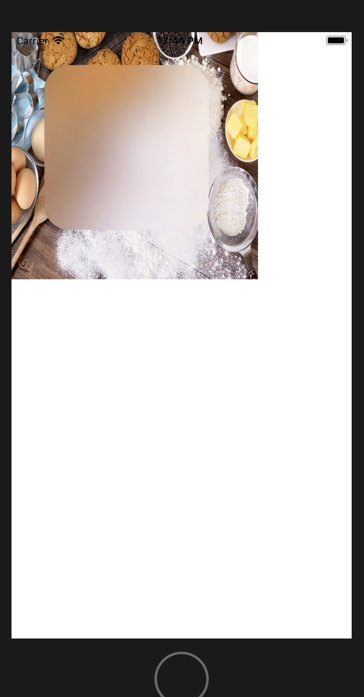

# 使用UIBlurEffect给图片添加模糊效果

- 原图：


- 执行效果：



- 实例代码：

```
    override func viewDidLoad()
    {
        super.viewDidLoad()
        /* 创建图片容器 */
        let myImage = UIImage(named: "2");
        let imageView = UIImageView(image: myImage);
        imageView.frame.size = CGSize(width: 300, height: 300);
        self.view.addSubview(imageView);
        
        //模糊效果处理
        if #available(iOS 8.0, *)
        {
            //8.0以后系统提供了模糊功能
            //初始化模糊效果对象
            let blur = UIBlurEffect(style: UIBlurEffectStyle.light);
            //初始化一个基于模糊效果的视觉效果图
            let blurView = UIVisualEffectView(effect: blur);
            //设置模糊试图位置
            blurView.frame = CGRect(x: 40, y: 40, width: 200, height: 200);
            //设置模糊视图的圆角半径
            blurView.layer.cornerRadius = 30;
            //设置模糊视图的遮罩覆盖属性，进行边界裁切
            blurView.layer.masksToBounds = true;
            //添加到imageview上
            imageView.addSubview(blurView);
        }
        else
        {
            print("8.0以上版本支持")
        }
    }
```

