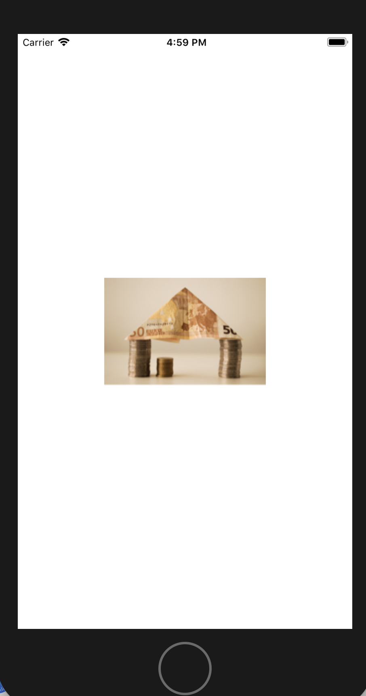

# ScrollView和PageControl

- 原图


- 实现效果



- 调用

```
    override func viewDidLoad()
    {
        super.viewDidLoad()
        // Do any additional setup after loading the view, typically from a nib.
        
        //读取图片
        let image = UIImage(named: "1");
        
        //调用图片缩放
        let scaledImage = scaleImage(image: image!, size: CGSize(width: 200, height: 200));
        
        let imageView = UIImageView(image: scaledImage);
        
        imageView.center = self.view.center;
        self.view.addSubview(imageView);
    }
```

- 封装缩放方法

```
    //使用图形上下文按一定比例缩放图片
    func scaleImage(image:UIImage,size:CGSize)->UIImage
    {
        //获取原图像尺寸
        let imageSize = image.size;
        //获得原图像宽高
        let imageHeight = imageSize.height;
        let imageWidth = imageSize.width;
        
        //计算图像新尺寸与旧尺寸的宽高比例
        let widthFactor = size.width/imageWidth;
        let heightFactor = size.height/imageHeight;
        //获取最小边比例
        let scaleFactor = (widthFactor<heightFactor) ? widthFactor:heightFactor;
        
        
        
        //计算图像新的宽度和高度，并将新的宽度和高度构建成标准的尺寸对象
        let scaleHeight = imageHeight * scaleFactor;
        let scaleWidth = imageWidth * scaleFactor;
        let targetSize = CGSize(width: scaleWidth, height: scaleHeight);
        
        //创建绘图上下文环境
        UIGraphicsBeginImageContext(targetSize);
        //将图像画入新尺寸中
        image.draw(in: CGRect(x: 0, y: 0, width: scaleWidth, height: scaleHeight));
        //获取上下文内容，将内容写入新图像对象
        let newImage = UIGraphicsGetImageFromCurrentImageContext();
        return newImage!;
    }
```