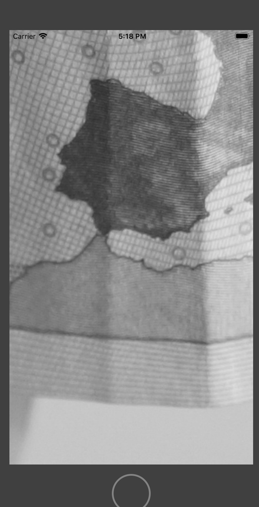

# ScrollView和PageControl

- 原图


- 实现效果



- 调用

```
    override func viewDidLoad()
    {
        super.viewDidLoad()
        // Do any additional setup after loading the view, typically from a nib.
        
        //读取图片
        let image = UIImage(named: "1");
        //将图片转化为灰度图
        let grayImage = drawGrayImage(image: image!, size: CGSize(width: 20, height: 20))
        let imageView = UIImageView(image: grayImage);
        imageView.center = self.view.center;
        self.view.addSubview(imageView);
    }
```

- 封装缩放方法

```
    //使用图形上下文转化图片为灰度图片
    func drawGrayImage(image:UIImage,size:CGSize)->UIImage
    {
        //获得源图像的尺寸
        let imageSize = image.size;
        let imageHeight = Int(imageSize.height);
        let imageWidth = Int(imageSize.width);
        
        //创建灰度色彩空间对象
        let spaceRef = CGColorSpaceCreateDeviceGray();
        //参数1：指向要渲染的绘制内存的地址
        //参数2、3：宽度、高度
        //参数4：内存中像素的每个组件的位数
        //参数5：内存所占的比特数
        //参数6：表示上下文使用的颜色空间
        //参数7：表示是否包含透明通道
        let context = CGContext(data: nil, width: imageWidth, height: imageHeight, bitsPerComponent: 8, bytesPerRow: 0, space: spaceRef, bitmapInfo: CGBitmapInfo().rawValue);
        
        //创建一个和原图像同样尺寸的空间
        let rect = CGRect(x: 0, y: 0, width: imageSize.width, height: imageSize.height);
        
        //在灰度上下文中绘入图片
        context?.draw(image.cgImage!, in: rect);
        let grayImage = UIImage(cgImage: (context?.makeImage())!);
        //返回图片
        return grayImage;
    }
```