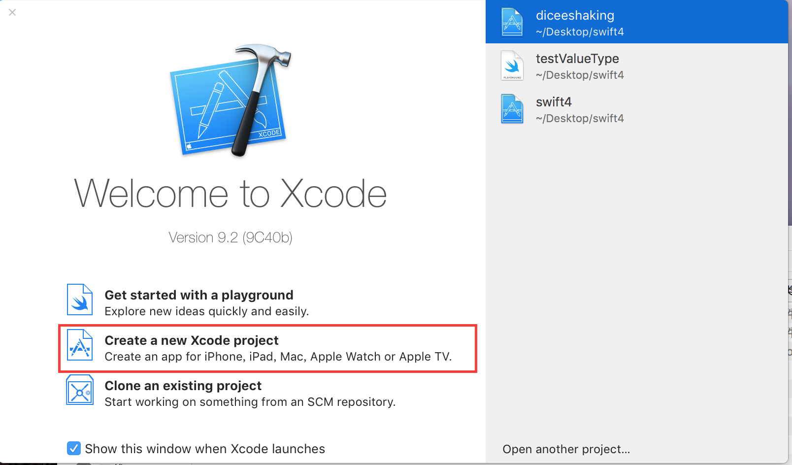
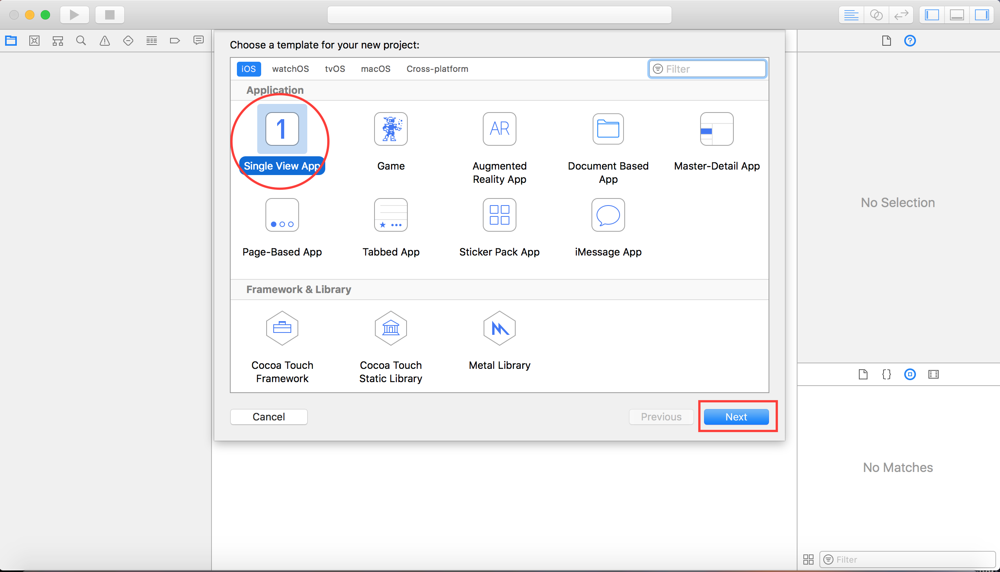
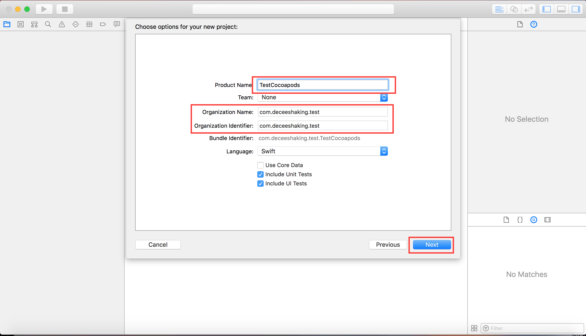
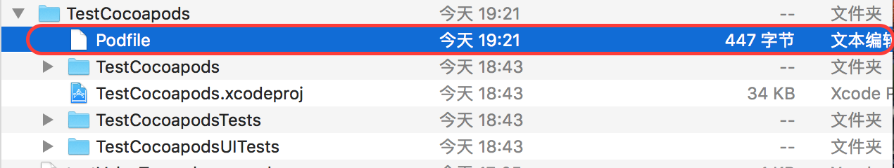
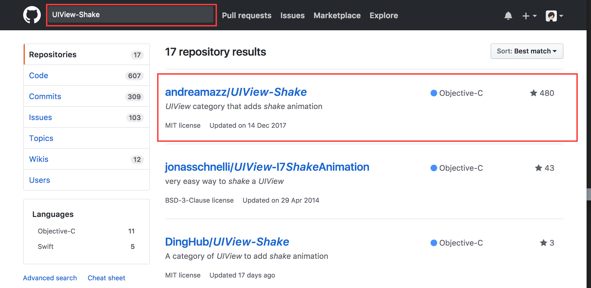
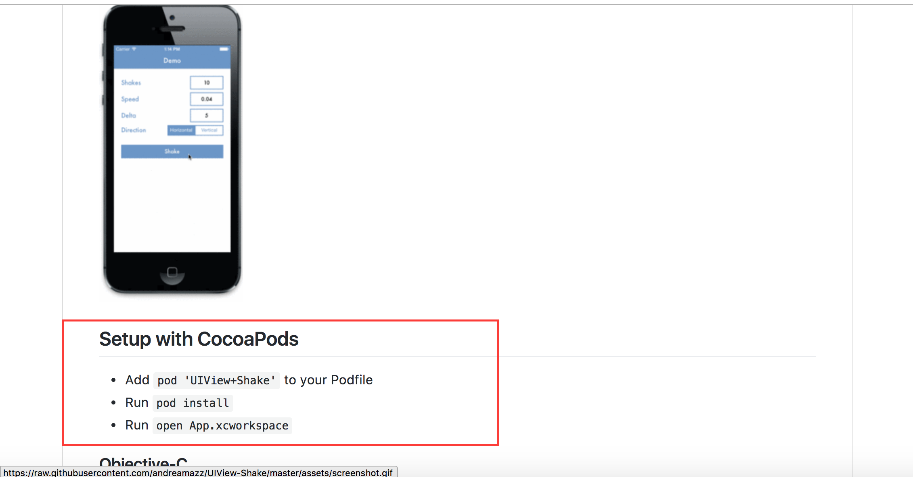
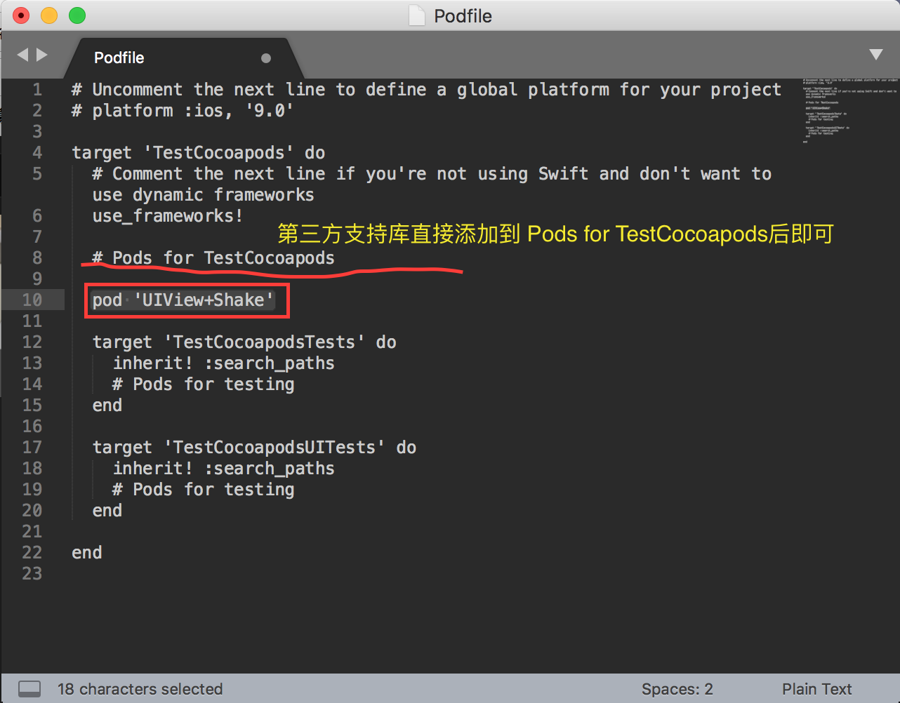
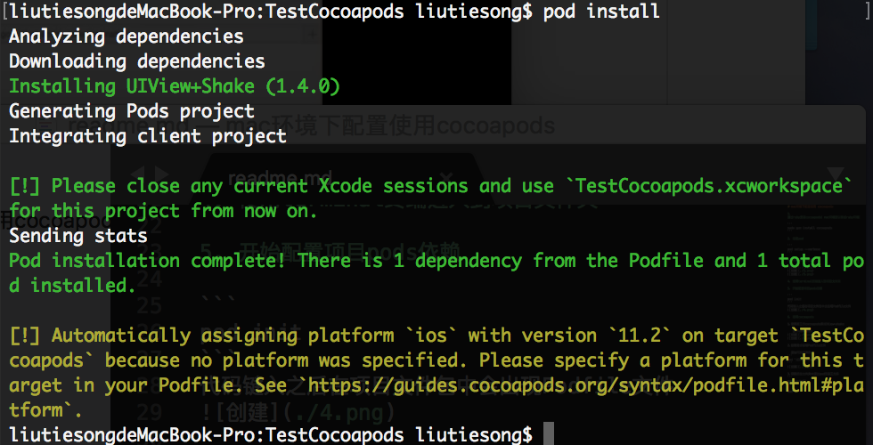
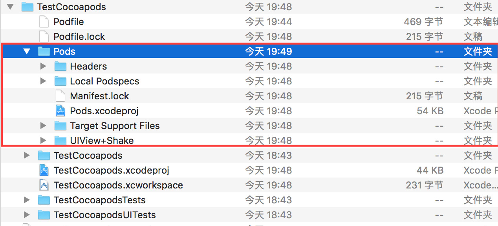
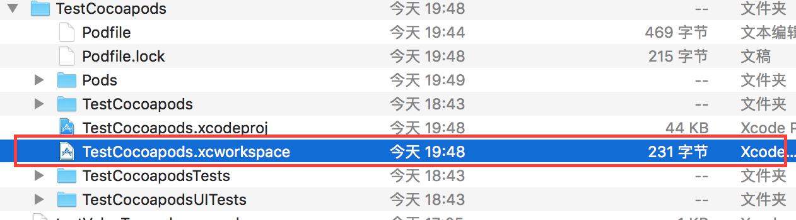

# mac环境下配置使用 cocoapods

1. 通过ruby安装cocoapods（mac环境默认集成ruby环境）

```
sudo gem install cocoapods
```

2. 设定pod

```
pod setup --verbose
```

3. 创建XCode项目





4. 使用terminal终端进入到项目文件夹

5. 开始配置项目pods依赖

```
pod init
```
代码键入之后在项目文件包中会出现Podfile文件


6. 使用cocoapods 

1.使用第三方cocoapods库UIView-shake

   github中寻找：



2.按照要求编辑Podfile文件

  添加代码后保存：
```
pod 'UIView+Shake'
```


3.项目所在文件夹中通过pod安装三方库
```
pod install
```

安装好后的项目文件路径下：

使用cocoapods安装的依赖库需要使用workspace打开并运行项目：

### 