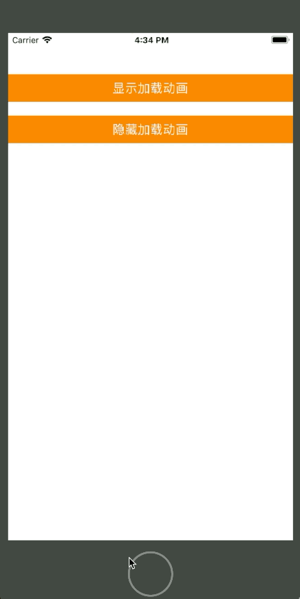
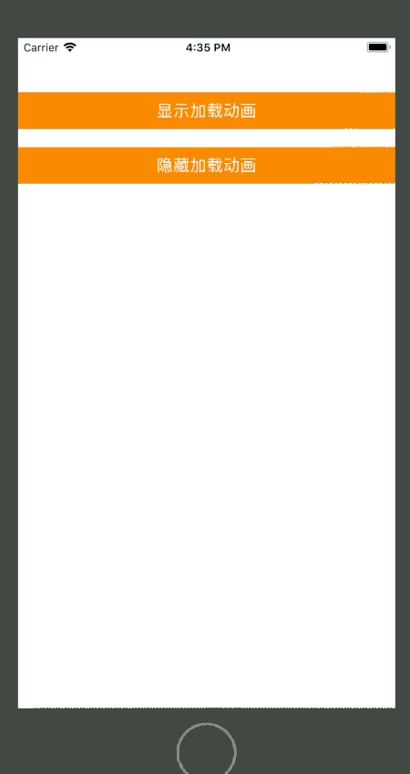
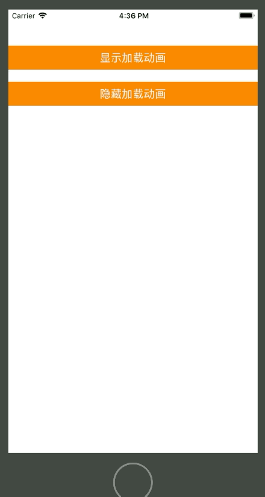

# EZLoadingActivity加载动画

- 执行效果：





- CocoaPods集成第三方库

```
  source 'https://github.com/CocoaPods/Specs.git'
  pod 'EZLoadingActivity'
```

- 实例代码：

```
    override func viewDidLoad() 
    {
        super.viewDidLoad()
        
        //设置加载动画显示按钮
        let playAnimation1 = UIButton(frame: CGRect(x: 0, y: 60, width: UIScreen.main.bounds.size.width, height: 40));
        playAnimation1.backgroundColor = UIColor.orange;
        playAnimation1.setTitle("显示加载动画", for: UIControlState.normal);
        playAnimation1.addTarget(self, action: #selector(showLoadingActivity(_:)), for: UIControlEvents.touchUpInside);
        self.view.addSubview(playAnimation1);
        
        //设置加载动画隐藏按钮
        let hideAnimation1 = UIButton(frame: CGRect(x: 0, y: 120, width: UIScreen.main.bounds.size.width, height: 40));
        hideAnimation1.backgroundColor = UIColor.orange;
        hideAnimation1.setTitle("隐藏加载动画", for: UIControlState.normal);
        hideAnimation1.addTarget(self, action: #selector(hideLoadingActivity(_:)), for: UIControlEvents.touchUpInside)
        self.view.addSubview(hideAnimation1);
        // Do any additional setup after loading the view, typically from a nib.
    }
```

```
    //按钮响应方法 - 显示加载动画：
    @objc func showLoadingActivity(_ button:UIButton)
    {
//        EZLoadingActivity.show("加载中....", disableUI: true)
        //设置加载窗体背景颜色
        EZLoadingActivity.Settings.BackgroundColor = UIColor.orange;
        //设置旋转图标颜色
        EZLoadingActivity.Settings.ActivityColor = UIColor.white;
        //设置文字颜色
        EZLoadingActivity.Settings.TextColor = UIColor.white;
        //加载完成时成功图标
        // Other possible stuff: ✓ ✓ ✔︎ ✕ ✖︎ ✘
        EZLoadingActivity.Settings.SuccessIcon = "✔︎";
        EZLoadingActivity.Settings.SuccessText = "加载成功";
        EZLoadingActivity.Settings.FailIcon = "✖︎";
        EZLoadingActivity.Settings.FailText = "加载失败";
        EZLoadingActivity.show("加载中....", disableUI: false)
    }
    //按钮响应方法 - 隐藏加载动画
    @objc func hideLoadingActivity(_ button:UIButton)
    {
        print("123123")
        //结束j加载动画 - 播放加载成功动画
//        EZLoadingActivity.hide(true, animated: true);
        //结束加载动画 - 播放加载失败动画
        EZLoadingActivity.hide(false, animated: true);
        //结束动画 - 不显示任何反馈动画
//        EZLoadingActivity.hide();
    }
```

