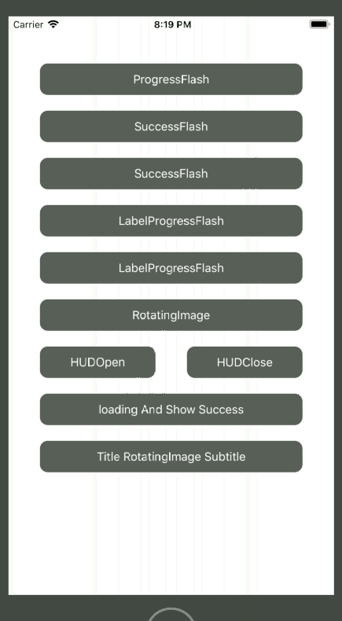
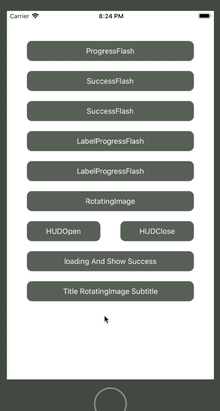
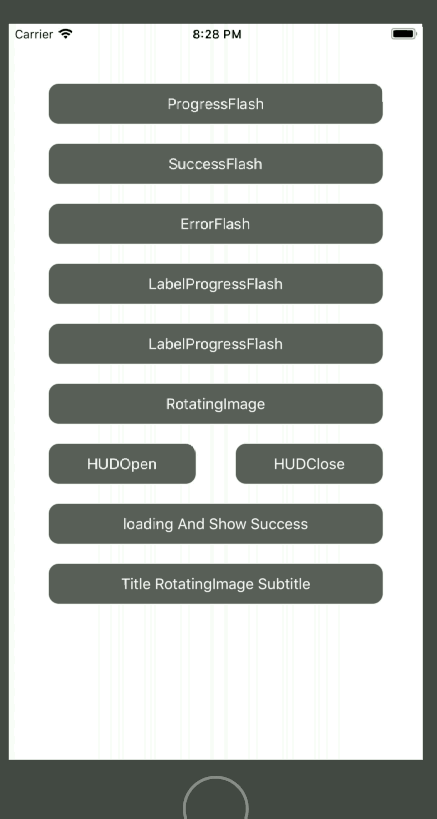
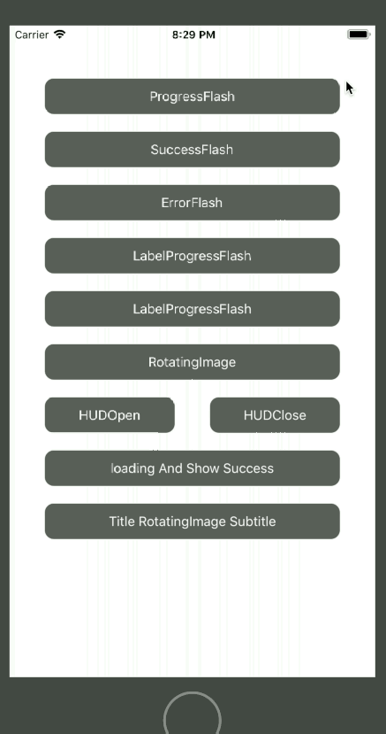
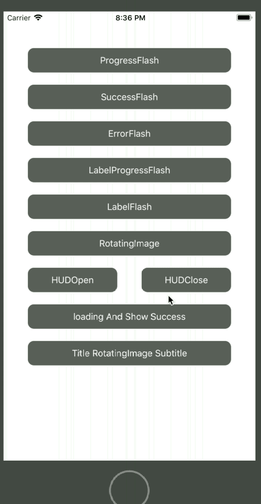
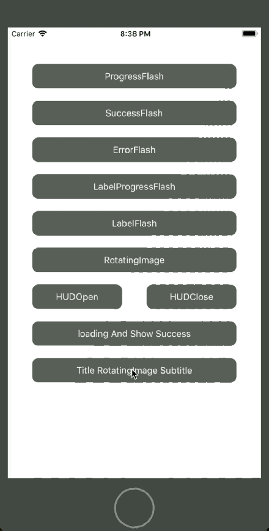
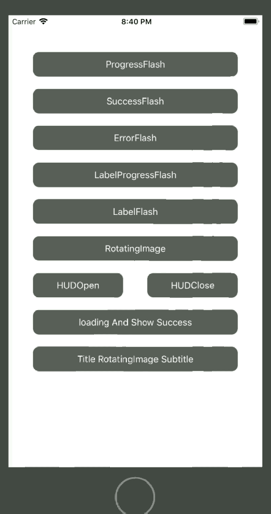
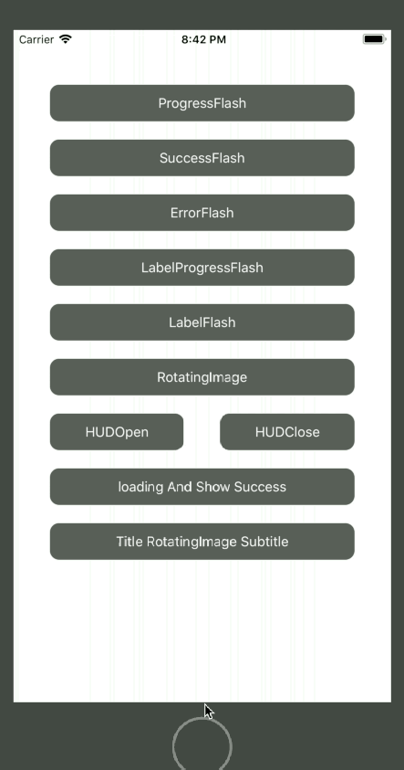
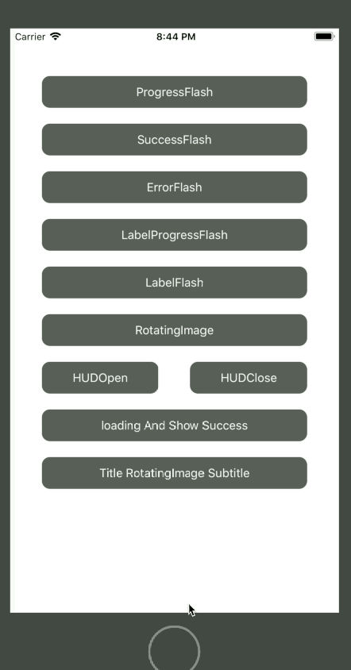

# PKHud提示窗体

- CocoaPods集成第三方库：

```
  source 'https://github.com/CocoaPods/Specs.git'
  pod 'PKHUD'
```

- 引入头：

```
import Toaster
```

- 设置背景遮罩用户交互控制：

```
    override func viewDidLoad()
    {
        super.viewDidLoad()
        //背景遮罩
        HUD.dimsBackground = true;
        //允许用户交互
        HUD.allowsInteraction = true;
    }
```

### 菊花加载自动消失效果

- 执行效果：



- 示例代码：

创建按钮

```
    let progressBtn : UIButton = {
        let button = UIButton(type: UIButtonType.system);
        button.frame = CGRect(x: 40, y: 60, width: UIScreen.main.bounds.size.width - 80, height: 40);
        button.setTitle("ProgressFlash", for: UIControlState.normal);
        button.backgroundColor = UIColor.darkGray;
        button.layer.cornerRadius = 10;
        button.tintColor = UIColor.white;
        button.addTarget(self, action: #selector(showProgressFlash), for: UIControlEvents.touchUpInside);
        return button;
    }()
```

添加到视图

```
    override func viewDidLoad()
    {
        super.viewDidLoad()
        self.view.addSubview(progressBtn)
    }
```

按钮响应方法

```
    @objc func showProgressFlash()
    {
        HUD.flash(HUDContentType.progress, delay: 1.0)
        {
            _ in
            print("progress-flash")
        }
    }
```

### 加载成功自动消失

- 执行效果：



- 示例代码：

创建按钮

```
    let successBtn : UIButton = {
        let button = UIButton(type: UIButtonType.system);
        button.frame = CGRect(x: 40, y: 120, width: UIScreen.main.bounds.size.width - 80, height: 40);
        button.setTitle("SuccessFlash", for: UIControlState.normal);
        button.backgroundColor = UIColor.darkGray;
        button.layer.cornerRadius = 10;
        button.tintColor = UIColor.white;
        button.addTarget(self, action: #selector(showSuccessFlash), for: UIControlEvents.touchUpInside);
        return button;
    }()
```

添加到视图

```
    override func viewDidLoad()
    {
        super.viewDidLoad()
        self.view.addSubview(successBtn)
    }
```

按钮响应方法

```
    @objc func showSuccessFlash()
    {
        HUD.flash(HUDContentType.success, delay: 1.0)
        {
            _ in
            print("success-flash")
        }
    }
```

### 加载失败自动消失

- 执行效果：



- 示例代码：

创建按钮

```
    let errorBtn : UIButton = {
        let button = UIButton(type: UIButtonType.system);
        button.frame = CGRect(x: 40, y: 180, width: UIScreen.main.bounds.size.width - 80, height: 40);
        button.setTitle("SuccessFlash", for: UIControlState.normal);
        button.backgroundColor = UIColor.darkGray;
        button.layer.cornerRadius = 10;
        button.tintColor = UIColor.white;
        button.addTarget(self, action: #selector(showErrorFlash), for: UIControlEvents.touchUpInside);
        return button;
    }()
```

添加到视图

```
    override func viewDidLoad()
    {
        super.viewDidLoad()
        self.view.addSubview(errorBtn)
    }
```

按钮响应方法

```
    @objc func showErrorFlash()
    {
        HUD.flash(HUDContentType.error, delay: 1.0)
        {
            _ in
            print("error-flash")
        }
        
    }
```

### 标题+动画+副标题+自动消失

- 执行效果：



- 示例代码：

创建按钮

```
    let labelProgressBtn : UIButton = {
        let button = UIButton(type: UIButtonType.system);
        button.frame = CGRect(x: 40, y: 240, width: UIScreen.main.bounds.size.width - 80, height: 40);
        button.setTitle("LabelProgressFlash", for: UIControlState.normal);
        button.backgroundColor = UIColor.darkGray;
        button.layer.cornerRadius = 10;
        button.tintColor = UIColor.white;
        button.addTarget(self, action: #selector(labelProgressFlash), for: UIControlEvents.touchUpInside);
        return button;
    }()
```

添加到视图

```
    override func viewDidLoad()
    {
        super.viewDidLoad()
        self.view.addSubview(labelProgressBtn)
    }
```

按钮响应方法

```
    @objc func labelProgressFlash()
    {
        HUD.flash(HUDContentType.labeledProgress(title: "加载标题", subtitle: "加载副标题"), delay: 2.0)
        {
            _ in
            print("labelProgress-flash")
        }
        
    }
```

### 标题+自动消失

- 执行效果：



- 示例代码：

创建按钮

```
    let labelBtn : UIButton = {
        let button = UIButton(type: UIButtonType.system);
        button.frame = CGRect(x: 40, y: 300, width: UIScreen.main.bounds.size.width - 80, height: 40);
        button.setTitle("LabelFlash", for: UIControlState.normal);
        button.backgroundColor = UIColor.darkGray;
        button.layer.cornerRadius = 10;
        button.tintColor = UIColor.white;
        button.addTarget(self, action: #selector(labelFlash), for: UIControlEvents.touchUpInside);
        return button;
    }()
```

添加到视图

```
    override func viewDidLoad()
    {
        super.viewDidLoad()
        self.view.addSubview(labelBtn)
    }
```

按钮响应方法

```
    @objc func labelFlash()
    {
        HUD.flash(HUDContentType.label("加载Label"), delay: 2.0)
        {
            _ in
            print("label-flash")
        }
        
    }
```

### 自定义图片旋转+自动消失

- 执行效果：



- 示例代码：

创建按钮

```
    let routingImgBtn : UIButton = {
        let button = UIButton(type: UIButtonType.system);
        button.frame = CGRect(x: 40, y: 360, width: UIScreen.main.bounds.size.width - 80, height: 40);
        button.setTitle("RotatingImage", for: UIControlState.normal);
        button.backgroundColor = UIColor.darkGray;
        button.layer.cornerRadius = 10;
        button.tintColor = UIColor.white;
        button.addTarget(self, action: #selector(routingFlash), for: UIControlEvents.touchUpInside);
        return button;
    }()
```

添加到视图

```
    override func viewDidLoad()
    {
        super.viewDidLoad()
        self.view.addSubview(routingImgBtn)
    }
```

按钮响应方法

```
    @objc func routingFlash()
    {
        HUD.flash(HUDContentType.rotatingImage(UIImage(named: "2")), delay: 2.0)
        {
            _ in
            print("routing-flash")
        }
    }
```

### 手动显示 - 手动消失

- 执行效果：



- 示例代码：

创建按钮

```
    let ctrlOpen : UIButton = {
        let button = UIButton(type: UIButtonType.system);
        button.frame = CGRect(x: 40, y: 420, width: UIScreen.main.bounds.size.width/2 - 60, height: 40);
        button.setTitle("HUDOpen", for: UIControlState.normal);
        button.backgroundColor = UIColor.darkGray;
        button.layer.cornerRadius = 10;
        button.tintColor = UIColor.white;
        button.addTarget(self, action: #selector(ctrlShow), for: UIControlEvents.touchUpInside);
        return button;
    }()
    let ctrlClose : UIButton = {
        let button = UIButton(type: UIButtonType.system);
        button.frame = CGRect(x: UIScreen.main.bounds.size.width/2 + 20, y: 420, width: UIScreen.main.bounds.size.width/2 - 60, height: 40);
        button.setTitle("HUDClose", for: UIControlState.normal);
        button.backgroundColor = UIColor.darkGray;
        button.layer.cornerRadius = 10;
        button.tintColor = UIColor.white;
        button.addTarget(self, action: #selector(ctrlHide), for: UIControlEvents.touchUpInside);
        return button;
    }()
```

添加到视图

```
    override func viewDidLoad()
    {
        super.viewDidLoad()
        self.view.addSubview(ctrlOpen)
        self.view.addSubview(ctrlClose)
    }
```

按钮响应方法

```
    @objc func ctrlShow()
    {
        HUD.show(.progress)
    }
    @objc func ctrlHide()
    {
        HUD.hide()
    }
```

### 加载 + 显示加载成功 + 自动消失

- 执行效果：



- 示例代码：

创建按钮

```
    let loadingShowSuccess : UIButton = {
        let button = UIButton(type: UIButtonType.system);
        button.frame = CGRect(x: 40, y: 480, width: UIScreen.main.bounds.size.width - 80, height: 40);
        button.setTitle("loading And Show Success", for: UIControlState.normal);
        button.backgroundColor = UIColor.darkGray;
        button.layer.cornerRadius = 10;
        button.tintColor = UIColor.white;
        button.addTarget(self, action: #selector(showAfterShowSuccess), for: UIControlEvents.touchUpInside);
        return button;
    }()
```

添加到视图

```
    override func viewDidLoad()
    {
        super.viewDidLoad()
        self.view.addSubview(loadingShowSuccess)
    }
```

按钮响应方法

```
    @objc func showAfterShowSuccess()
    {
//        第一种写法：
//        HUD.show(HUDContentType.progress)
//        HUD.hide(afterDelay: 2.0)
//        {
//            finished in
//            HUD.flash(HUDContentType.success, delay: 1.0)
//        }
//        第二种写法：(更顺畅)
        HUD.show(.progress)
        // Now some long running task starts...
        DispatchQueue.main.asyncAfter(deadline: .now() + 2) {
            // ...and once it finishes we flash the HUD for a second.
            HUD.flash(.success, delay: 1.0)
        }
    }
```

### 标题 + 副标题 + 自定义旋转动画 + 自动消失

- 执行效果：



- 示例代码：

创建按钮

```
    let rotatingImgAndTextBtn : UIButton = {
        let button = UIButton(type: UIButtonType.system);
        button.frame = CGRect(x: 40, y: 540, width: UIScreen.main.bounds.size.width - 80, height: 40);
        button.setTitle("Title RotatingImage Subtitle", for: UIControlState.normal);
        button.backgroundColor = UIColor.darkGray;
        button.layer.cornerRadius = 10;
        button.tintColor = UIColor.white;
        button.addTarget(self, action: #selector(showRotatingImgAndText), for: UIControlEvents.touchUpInside);
        return button;
    }()
```

添加到视图

```
    override func viewDidLoad()
    {
        super.viewDidLoad()
        self.view.addSubview(rotatingImgAndTextBtn)
    }
```

按钮响应方法

```
    @objc func showRotatingImgAndText()
    {
        HUD.flash(HUDContentType.labeledRotatingImage(image: UIImage(named: "2"), title: "标题", subtitle: "副标题"), delay: 2.0)
        {
            _ in
            print("title-subtitle-image")
        }
    }
```


