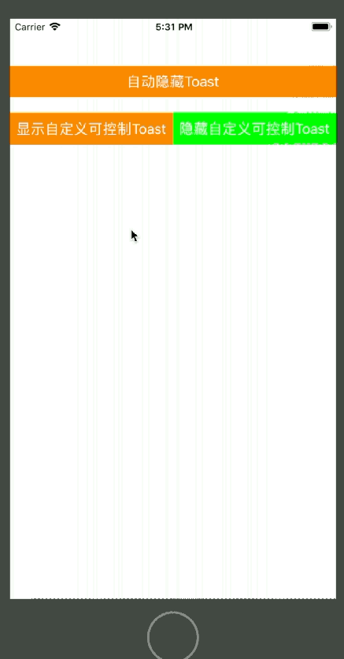
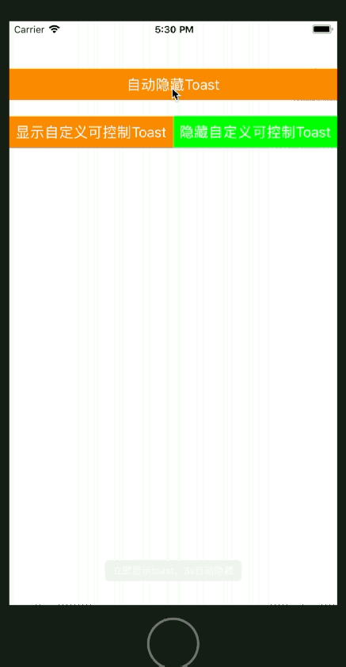
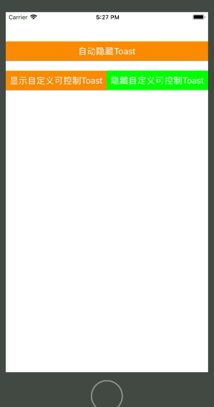
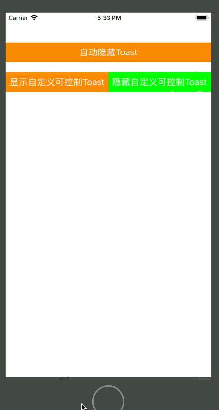

# Toaster提示动画

- 执行效果：

自动隐藏型：



手动控制型：




- CocoaPods集成第三方库

```
  source 'https://github.com/CocoaPods/Specs.git'
  pod 'Toaster'
```

### 实例代码：

- 引入头

```
import Toaster
```

- 自动隐藏Toast

```
        //自动隐藏Toast
        let toast1Btn = UIButton(frame: CGRect(x: 0, y: 60, width: UIScreen.main.bounds.size.width, height: 40));
        toast1Btn.backgroundColor = UIColor.orange;
        toast1Btn.setTitle("自动隐藏Toast", for: UIControlState.normal);
        toast1Btn.addTarget(self, action: #selector(showToast1(_:)), for: UIControlEvents.touchUpInside);
        self.view.addSubview(toast1Btn);
```

```
    //按钮响应方法 - 自动隐藏toast
    @objc func showToast1(_ button:UIButton)
    {
        Toast(text: "普通Toast").show()
//        Toast(text: "立即显示toast，3s自动隐藏", duration: Delay.long).show()
//        Toast(text: "2s后显示toast，3s后自动隐藏", delay: Delay.short, duration: Delay.long).show()
    }
```

- 手动控制Toast

```
        //自定义可控制Toast
        let ctrlToastOpen = UIButton(frame: CGRect(x: 0, y: 120, width: UIScreen.main.bounds.size.width/2, height: 40));
        ctrlToastOpen.backgroundColor = UIColor.orange;
        ctrlToastOpen.setTitle("显示自定义可控制Toast", for: UIControlState.normal);
        ctrlToastOpen.addTarget(self, action: #selector(showCtrlToast(_:)), for: UIControlEvents.touchUpInside);
        self.view.addSubview(ctrlToastOpen);
        let ctrlToastClose = UIButton(frame: CGRect(x: UIScreen.main.bounds.size.width/2, y: 120, width: UIScreen.main.bounds.size.width/2, height: 40));
        ctrlToastClose.backgroundColor = UIColor.green;
        ctrlToastClose.setTitle("隐藏自定义可控制Toast", for: UIControlState.normal);
        ctrlToastClose.addTarget(self, action: #selector(hideCtrlToast(_:)), for: UIControlEvents.touchUpInside);
        self.view.addSubview(ctrlToastClose);
```

```
    //按钮响应方法 - 可控toast显示
    @objc func showCtrlToast(_ button:UIButton)
    {
        let ctrlToast = Toast(text: "可控toast")
        //设置toast样式
        ToastView.appearance().backgroundColor = UIColor.orange;
        ToastView.appearance().textColor = UIColor.white;
        ToastView.appearance().font = UIFont(name: "Arial", size: 12);
        //设置提示文字在窗口中的边距
        ToastView.appearance().textInsets = UIEdgeInsets(top: 16, left: 20, bottom: 16, right: 20)
        //设置圆角半径
        ToastView.appearance().cornerRadius = 10;
        //设置设备竖立状态与底部间距
        ToastView.appearance().bottomOffsetPortrait = 200;
        ctrlToast.show();
    }
    //按钮响应方法 - 可控toast隐藏
    @objc func hideCtrlToast(_ button:UIButton)
    {
//        ctrlToast.cancel();
        //通过toast窗口管理中心获取当前窗口
        if let currentToast = ToastCenter.default.currentToast
        {
            currentToast.cancel();
        }
        //关闭所有toast
        ToastCenter.default.cancelAll();
    }
```
