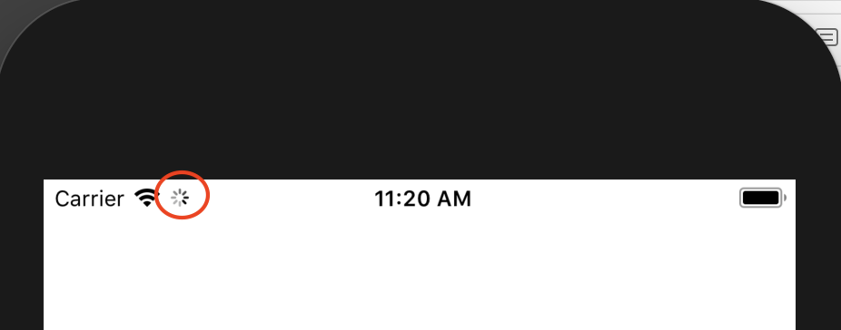

# IOS顶部statusbar进度加载效果

- 效果：



- 开始加载进度操作

```
UIApplication.shared.isNetworkActivityIndicatorVisible = true;
```

- 结束加载进度操作

```
UIApplication.shared.isNetworkActivityIndicatorVisible = true;
```