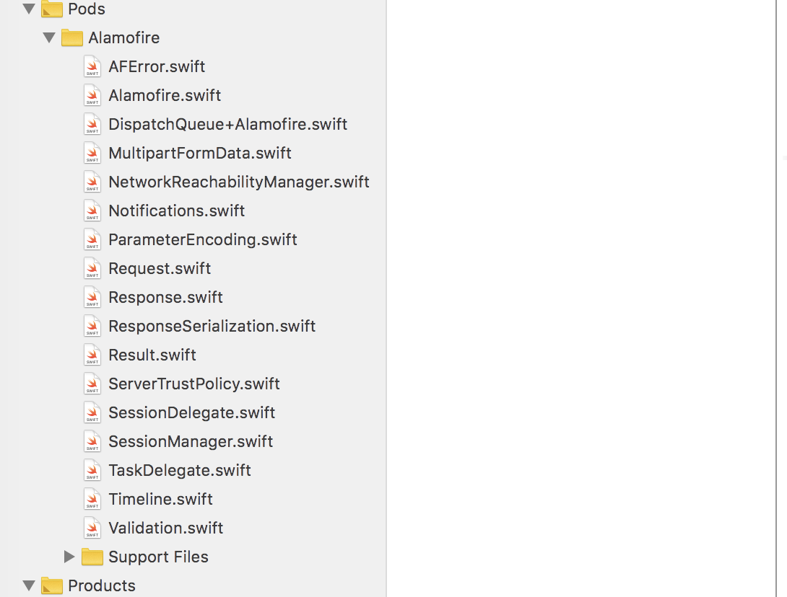
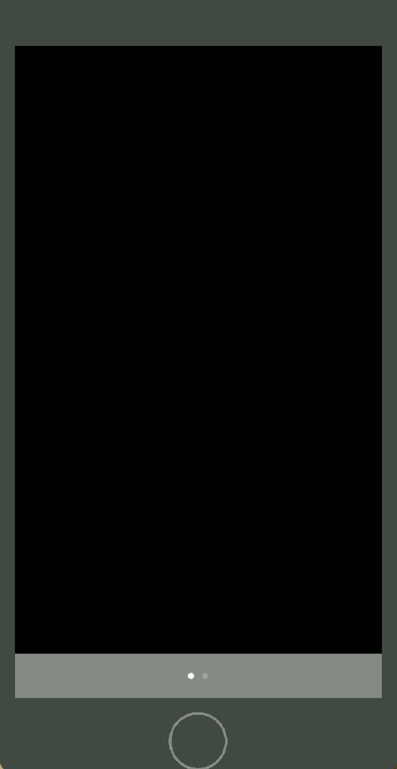

# ScrollView和PageControl

- 文件夹目录



- 实现效果



- 声明全局属性

```
//创建scrollview对象
var scrollview = UIScrollView();
//创建pagecontrol对象
var pageControl = UIPageControl();
var ispageControlUsed = false;
```

- scrollView创建

```
/* 滚动式图控制器创建 - scrollview */
//创建一个区域显示创建好的视图控制器
scrollview.frame = UIScreen.main.bounds;
//设置滚动视图为分页模式，一次滚动一页
scrollview.isPagingEnabled = true;
//设置scrollview尺寸
scrollview.contentSize = CGSize(width: UIScreen.main.bounds.width*2, height: UIScreen.main.bounds.height);
//设置背景颜色
scrollview.backgroundColor = UIColor.yellow;
//授权代理
scrollview.delegate = self;
```

- pageControl创建

```
/* 页面控制器创建 - pagecontrol */
//设置尺寸
pageControl.frame = CGRect(x: 0, y: UIScreen.main.bounds.height-50, width: UIScreen.main.bounds.width, height: 50);
//设置分页
pageControl.numberOfPages = 2;
//设置当前页编号
pageControl.currentPage = 0;
//设置背景色
pageControl.backgroundColor = UIColor.gray;
//添加切换页面触发方法监听
pageControl.addTarget(self, action: #selector(pageDidChanged(_:)), for: UIControlEvents.valueChanged);
```


- 子视图放入scrollview

```
/* 放置视图 */
//第一个视图
let firstPage = FirstViewController()
//设置显示位置
firstPage.view.frame.origin.x = 0;
        
//第二个视图
let secondPage = SecondViewController();
//设置位置
secondPage.view.frame.origin.x = UIScreen.main.bounds.width;
```

- 将scrollview与pagecontrol放入总视图控制器

```
/* 视图添加到scrollview中 */
scrollview.addSubview(firstPage.view);
scrollview.addSubview(secondPage.view);
/* scrollview与pagecontrol添加到页面控制器 */
self.view.addSubview(scrollview);
self.view.addSubview(pageControl);
```

- 实现页面切换方法监听

```
    @objc func pageDidChanged(_ sender:AnyObject)
    {
        print("当前页码：\(sender.currentPage)");
        //获得当前页码
        let currentPage = CGFloat(sender.currentPage);
        //获取滚动式图当前的显示区域
        var frame = scrollview.frame;
        //根据页面控制器的目标页码，计算滚动式图在下一页中的显示区域
        frame.origin.x = frame.size.width * currentPage;
        frame.origin.y = 0;
        
        //滚动到指定位置
        scrollview.scrollRectToVisible(frame, animated: true);
        //设置通过页面控制器切换页面
        ispageControlUsed = true;
    }
```

- 滚动视图的响应方法监听

```
    //监听滚动式图的滚动事件代理方法
    func scrollViewDidScroll(_ scrollView: UIScrollView)
    {
        //如果通过页面控制器地向切换页面则不执行后面代码
        if (!ispageControlUsed)
        {
            //获取滚动式图宽度
            let pageWidth = scrollview.frame.size.width;
            //根据滚动式图的宽度和横向位移量，计算当前页码
            let pageNum = floor((scrollView.contentOffset.x-pageWidth/2)/pageWidth)+1;
            //设置页面控制器显示的页码
            pageControl.currentPage = Int(pageNum);
        }
    }
    //监听滚动式图的减速事件代理方法，重置标识变量的默认值
    func scrollViewDidEndDecelerating(_ scrollView: UIScrollView)
    {
        ispageControlUsed = false;
    }
```


