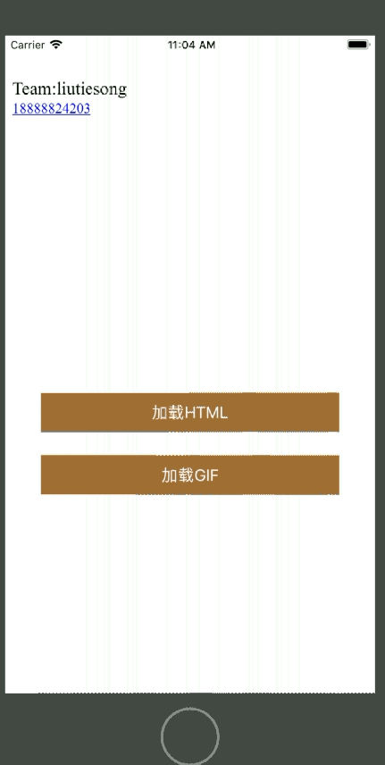

# UIWebview加载html代码与gif

- 执行效果：



### 实例代码：

- 创建元素样式

```
var webView : UIWebView!;
    override func viewDidLoad()
    {
        super.viewDidLoad()
        webView = UIWebView(frame: CGRect(x: 0, y: 40, width: UIScreen.main.bounds.width, height: 300));
        webView.backgroundColor = UIColor.lightGray;
        self.view.addSubview(webView);
        
        //加载网页按钮
        let loadHtmlBtn = UIButton(frame: CGRect(x: 40, y: 400, width: UIScreen.main.bounds.width - 80, height: 44));
        loadHtmlBtn.setTitle("加载HTML", for: UIControlState.normal);
        loadHtmlBtn.backgroundColor = UIColor.brown;
        loadHtmlBtn.addTarget(self, action: #selector(loadHtml), for: UIControlEvents.touchUpInside);
        self.view.addSubview(loadHtmlBtn);
        
        //加载gif按钮
        let loadGifBtn = UIButton(frame: CGRect(x: 40, y: 470, width: UIScreen.main.bounds.width - 80, height: 44));
        loadGifBtn.setTitle("加载GIF", for: UIControlState.normal);
        loadGifBtn.backgroundColor = UIColor.brown;
        loadGifBtn.addTarget(self, action: #selector(loadGif), for: UIControlEvents.touchUpInside);
        self.view.addSubview(loadGifBtn);
    }
```

- 按钮响应方法

```
    //响应加载网页按钮点击事件
    @objc func loadHtml()
    {
        let tesm="<div style='color:#f0000;font-size:20px'>Team:liutiesong</div>";
        let tel = "<div><span style='color:#ff0000'>18888824203</span></div>";
        let html = tesm+tel;
        
        //设置网页检测类型，网页视图内容将会突出显示符合该类型的内容
        webView.dataDetectorTypes = [UIDataDetectorTypes.link,UIDataDetectorTypes.phoneNumber];
        //调用家在网页字符串方法
        webView.loadHTMLString(html, baseURL: nil);
    }
    //响应加载gif按钮点击事件
    @objc func loadGif()
    {
        let resourceUrl = Bundle.main.resourceURL;
        webView.loadHTMLString("", baseURL: resourceUrl);
    }
```

