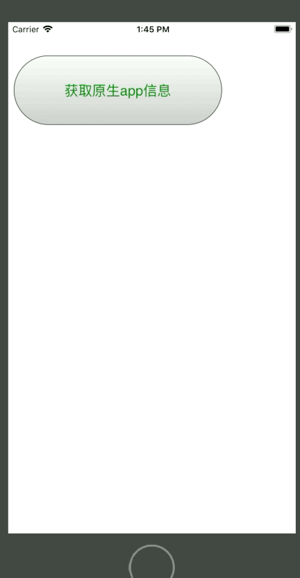

# js调用原生程序

- 执行效果：



### 实例代码：

- HTML-Demo代码：

```
<!DOCTYPE html>
<html>
    <head>
        <title>测试html</title>
        <meta charset="utf-8" http-equiv="Content-Type" content="text/html">
            <script type="text/javascript">
                function getDevice (argument) {
                    document.location = "callios:getDeviceInfo";
                }
            </script>
    </head>
    <body>
        <input type="button" value="获取原生app信息" onclick="getDevice()" style="height: 100px;width: 300px;color: green;font-size: 20px">
    </body>
</html>
```

- 示例代码：

```
class ViewController: UIViewController,UIWebViewDelegate 
{
    var webView : UIWebView!;

    override func viewDidLoad()
    {
        super.viewDidLoad()
        webView = UIWebView(frame: CGRect(x: 0, y: 40, width: UIScreen.main.bounds.width, height: 300));
        webView.backgroundColor = UIColor.lightGray;
        //设置网页视图的代理对象
        webView.delegate = self;
        self.view.addSubview(webView);
        
        //获得本地网页路径
        let path = Bundle.main.path(forResource: "index", ofType: "html")
        //将路径转化为网址样式
        let url = URL(string: path!);
        //加载网页
        webView.loadRequest(NSURLRequest(url: url!) as URLRequest)
        

    }

    
    //监听方法 - 网页视图即将家在调用
    func webView(_ webView: UIWebView, shouldStartLoadWith request: URLRequest, navigationType: UIWebViewNavigationType) -> Bool
    {
        
        //获得网页视图即将加载的网址字符串
        let url = request.url?.absoluteString;
        //将网址以冒号进行分割，并生成一个包含两个字符串的数组
        let components = url?.components(separatedBy: ":");
        //获得数组第一个元素
        let firstElement = components?[0];
        //如果数组中第一个元素与网页文件中编写的脚本一致，则执行之后代码
        if (components?.count)! > 1 && firstElement == "callios"
        {
            //获得当前设备的模型信息
            let model = UIDevice.current.model;
            //获得当前设备的操作系统名称
            let systemName = UIDevice.current.systemName;
            //获得操作系统版本号
            let systemVersion = UIDevice.current.systemVersion;
            
            //返回字符串信息
            let message = "Device model:"+model+"\\nSystem name:"+systemName+"\\nSystem version:"+systemVersion;
            print(message);
            webView.stringByEvaluatingJavaScript(from: "alert('"+message+"')");
            return false;//终止网页视图家在动作
        }
        return true;
    }
}
```
