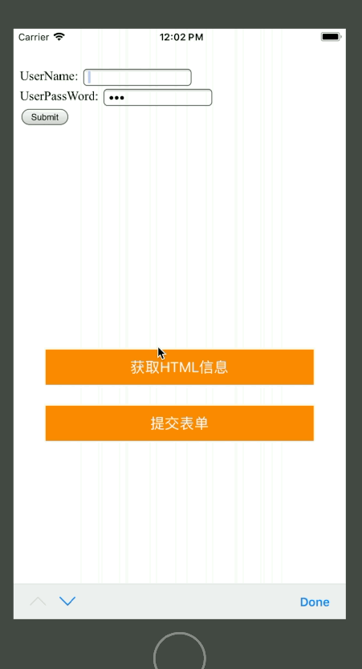

# 使用UIWebView家在本地页面并调用JS代码

- 执行效果：



### 实例代码：

- HTML-Demo代码

```
<!DOCTYPE html>
<html>
<head>
    <title>测试html</title>
    <meta charset="utf-8" http-equiv="Content-Type" content="text/html">
    <script type="text/javascript">
        function submitForm (argument) {
            var userName = document.getElementById('userName').value
            alert("输出用户名"+userName);
        }
    </script>
</head>
<body>
    <form action="form_action.php" id="registerForm" onsubmit="submitForm()">
        UserName: <input type="text" id="userName" name="userName"> <br>
        UserPassWord: <input type="password" id="password" name="password"> <br>
        <input type="submit" value="Submit">
    </form>
</body>
</html>
```

- 样式初始化代码

```
    var webView : UIWebView!;

    override func viewDidLoad()
    {
        super.viewDidLoad()
        webView = UIWebView(frame: CGRect(x: 0, y: 40, width: UIScreen.main.bounds.width, height: 300));
        webView.backgroundColor = UIColor.lightGray;
        self.view.addSubview(webView);
        
        //获得本地网页路径
        let path = Bundle.main.path(forResource: "index", ofType: "html")
        //将路径转化为网址样式
        let url = URL(string: path!);
        //家在网页
        webView.loadRequest(NSURLRequest(url: url!) as URLRequest)
        
        //获取信息按钮
        let getInfo = UIButton(frame: CGRect(x: 40, y: 400, width: UIScreen.main.bounds.size.width-80, height: 44));
        getInfo.setTitle("获取HTML信息", for: UIControlState.init(rawValue: 0));
        getInfo.backgroundColor = UIColor.orange;
        getInfo.addTarget(self, action: #selector(getHtmlInfo), for: UIControlEvents.touchUpInside);
        self.view.addSubview(getInfo);
        
        //提交表单按钮
        let submitForm = UIButton(frame: CGRect(x: 40, y: 470, width: UIScreen.main.bounds.size.width-80, height: 44));
        submitForm.setTitle("提交表单", for: UIControlState.init(rawValue: 0));
        submitForm.backgroundColor = UIColor.orange;
        submitForm.addTarget(self, action: #selector(submit), for: UIControlEvents.touchUpInside);
        self.view.addSubview(submitForm);
    }
```

- 按钮响应方法

```
    //响应获取信息按钮方法
    @objc func getHtmlInfo()
    {
        //获得网页所对应的网址字符串
        let url = webView.stringByEvaluatingJavaScript(from: "document.location.href");
        //获得网页标题信息
        let title = webView.stringByEvaluatingJavaScript(from: "document.title");
        print(url);
        print(title);
    }
    //响应提交表单按钮方法
    @objc func submit()
    {
        //给userName赋值：
        webView.stringByEvaluatingJavaScript(from: "document.getElementById('userName').value='Jerry'");
        //调用JS提交表单方法
        webView.stringByEvaluatingJavaScript(from: "submitForm()");
    }
```

