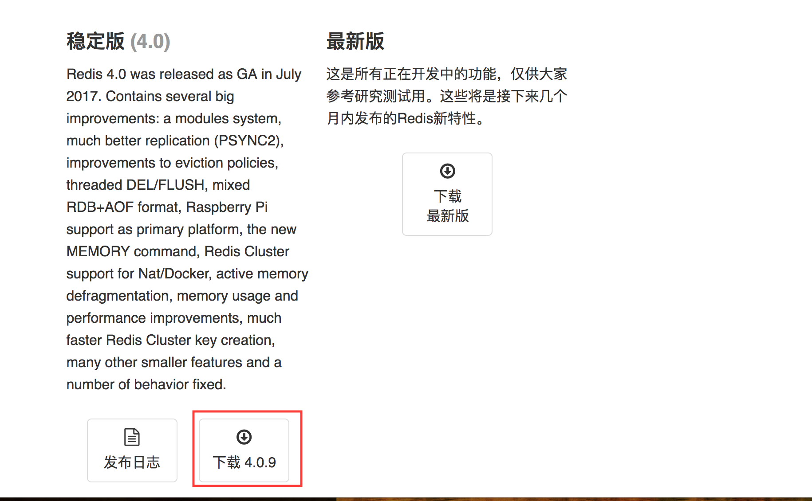
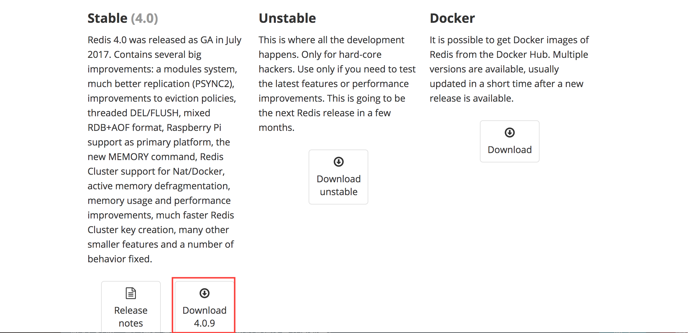
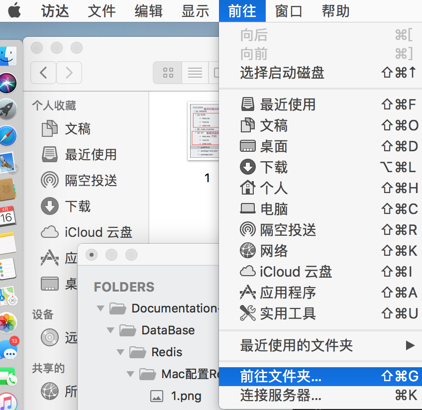
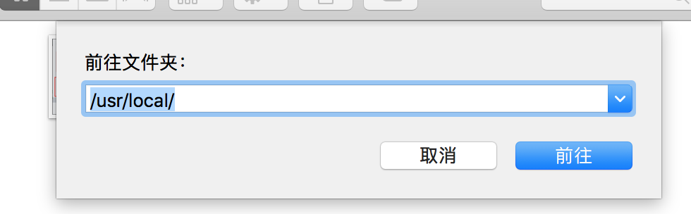
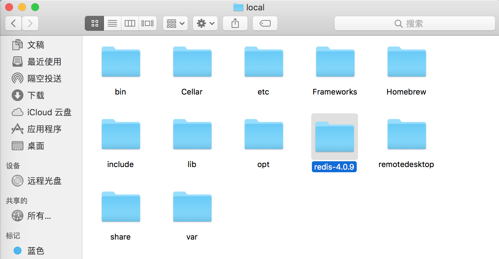
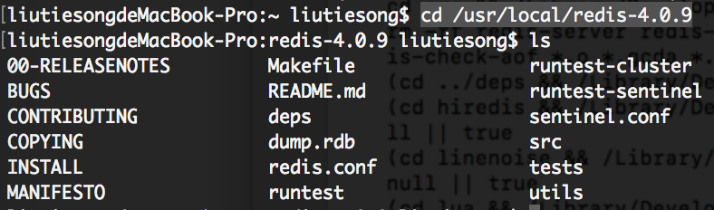
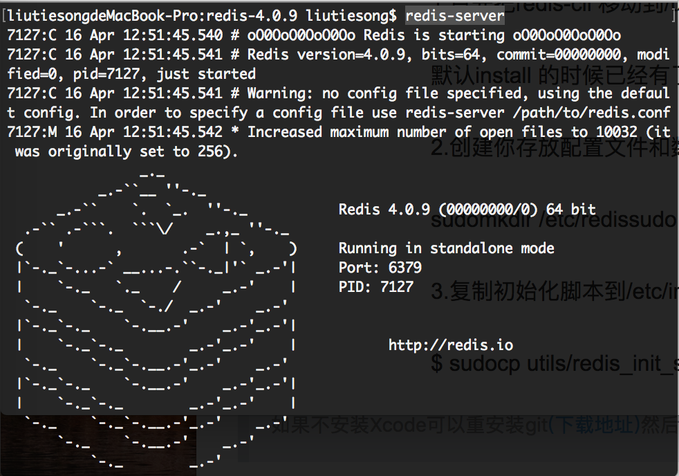

# Mac系统配置Redis开发环境与启动

* [Redis官网（翻墙）](https://redis.io/)
* [Redis中文站](http://www.redis.cn/download.html)


### 下载Redis：

官网或者中文站下载最新稳定版安装包：



### 解压到配置环境：
1. 解压下载好的压缩文件：redis-4.0.9.tar.gz



2. 桌面-前往-前往文件夹到‘/usr/local’目录下 



3. 将解压后的文件夹放到local目录下



4. 使用终端terminal切换到/usr/local/redis-4.0.9目录下

```
cd /usr/local/redis-4.0.9
```


5. 编译测试

```
sudo make test
```

5. 编译安装

```
sudo make install
```

### redis基本使用：

1. 启动redis服务：

```
redis-server
```


2. 检查redis是否启用

```
redis-cli ping
```

3. 关闭redis 

```
redis-cli shutdown
```