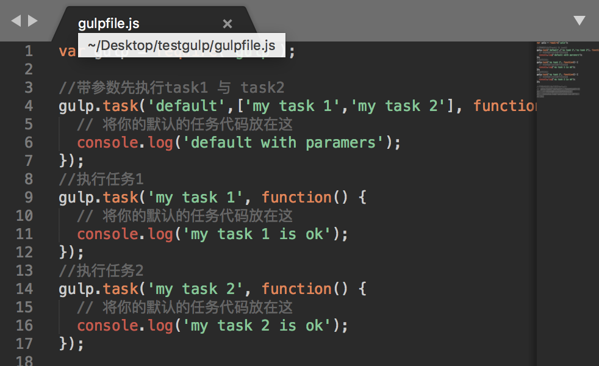
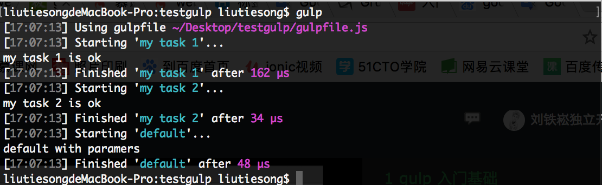
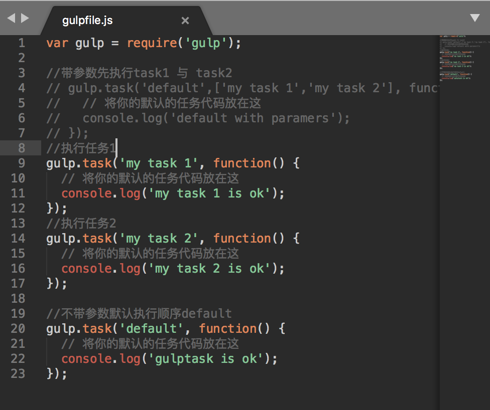
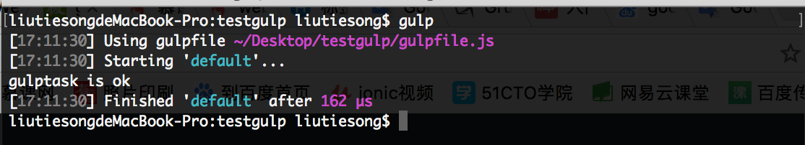

# gulp多任务流
[gulp中文官方站：www.gulpjs.com.cn](https://www.gulpjs.com.cn)


1. 多任务按流顺序依次执行

```
var gulp = require('gulp');

//带参数先执行task1 与 task2
gulp.task('default',['my task 1','my task 2'], function() {
  // 将你的默认的任务代码放在这
  console.log('default with paramers');
});
//执行任务1
gulp.task('my task 1', function() {
  // 将你的默认的任务代码放在这
  console.log('my task 1 is ok');
});
//执行任务2
gulp.task('my task 2', function() {
  // 将你的默认的任务代码放在这
  console.log('my task 2 is ok');
});
```
代码：

执行结果：


2. 不带参数默认执行default

```
var gulp = require('gulp');

//执行任务1
gulp.task('my task 1', function() {
  // 将你的默认的任务代码放在这
  console.log('my task 1 is ok');
});
//执行任务2
gulp.task('my task 2', function() {
  // 将你的默认的任务代码放在这
  console.log('my task 2 is ok');
});

//不带参数默认执行顺序default
gulp.task('default', function() {
  // 将你的默认的任务代码放在这
  console.log('gulptask is ok');
});
```
代码：

执行结果：
