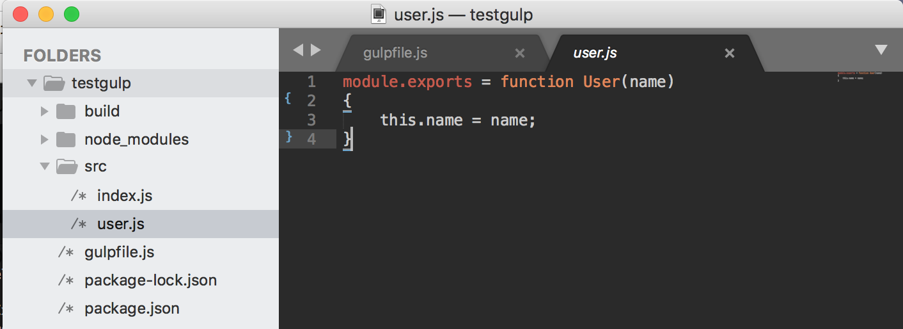
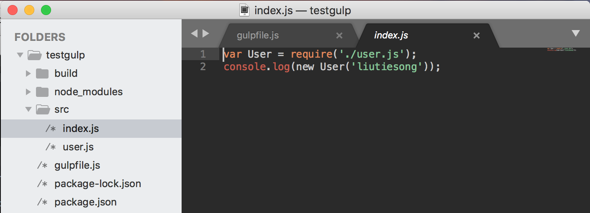
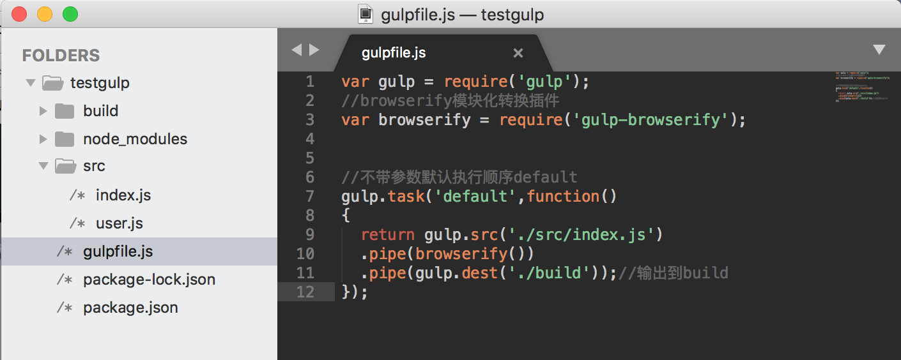
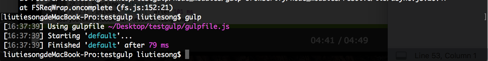
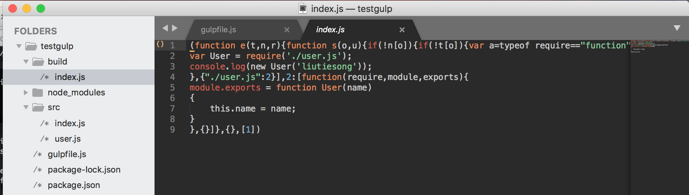

# gulp通过browserify进行代码模块化
[gulp中文官方站：www.gulpjs.com.cn](https://www.gulpjs.com.cn)

### - 安装配置开发环境

1. 安装配置browserify

```
npm install browserify --save-dev
```

2. 安装gulp-browserify插件

```
npm install gulp-browserify --save-dev
```

2. browserify main.js > bundle.js转换命令 


### - 使用browserify进行模块化开发代码打包

1. 创建user.js index.js文件

user.js:


index.js:



2. 配置gulpfile文件代码

```
var gulp = require('gulp');
//browserify模块化转换插件
var browserify = require('gulp-browserify');

//不带参数默认执行顺序default
gulp.task('default',function() 
{
  return gulp.src('./src/index.js')
  .pipe(browserify())
  .pipe(gulp.dest('./build'));//输出到build
});
```


3. 终端指令gulp运行测试代码

终端：

输出结果到build文件夹中：



