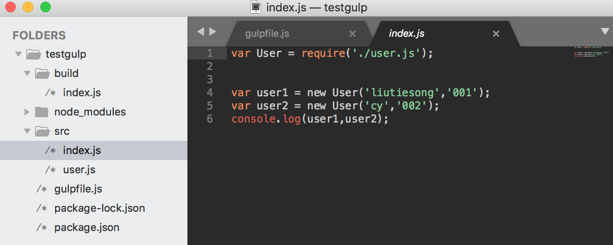
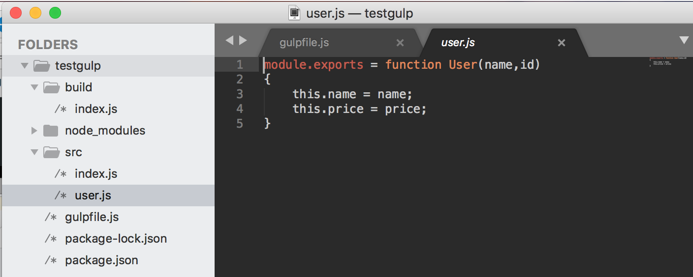
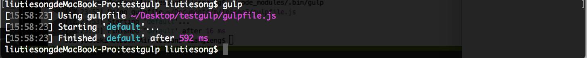
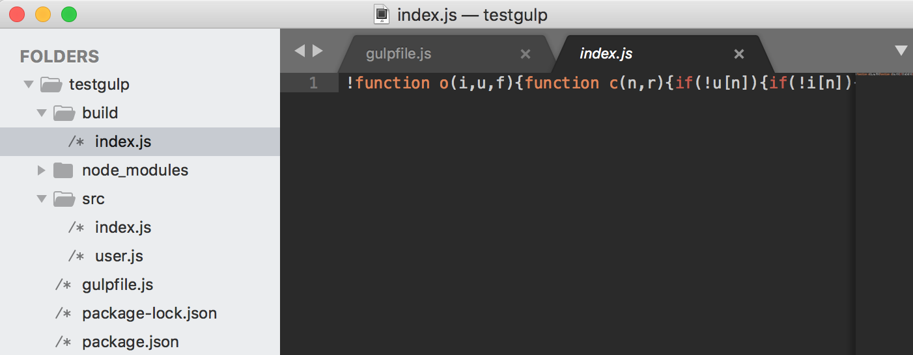

# gulp通过gulp-uglify进行代码压缩
[gulp中文官方站：www.gulpjs.com.cn](https://www.gulpjs.com.cn)

### - 安装配置开发环境

1. 安装配置gulp-uglify插件

```
npm install gulp-uglify
```

### - 使用gulp-jasmine进行代码测试

1. 配置预编译的代码 index.js 与 user.js

index.js:

```
var User = require('./user.js');
var user1 = new User('liutiesong','001');
var user2 = new User('cy','002');
console.log(user1,user2);
```
user.js:
```
module.exports = function User(name,id)
{
	this.name = name;
	this.price = price;
}
```



2. 配置gulpfile文件代码

```
var gulp = require('gulp');
//browserify模块化转换插件
var browserify = require('gulp-browserify');
//uglify模块化转换插件
var uglify = require('gulp-uglify');

//不带参数默认执行顺序default
gulp.task('default',function() 
{
  return gulp.src('./src/index.js')
  .pipe(browserify())//模块化处理
  .pipe(uglify())//压缩处理
  .pipe(gulp.dest('./build'));//输出到build
});
```

3. 终端指令gulp运行结果

终端运行结果：

输出到build文件夹中压缩代码效果：



