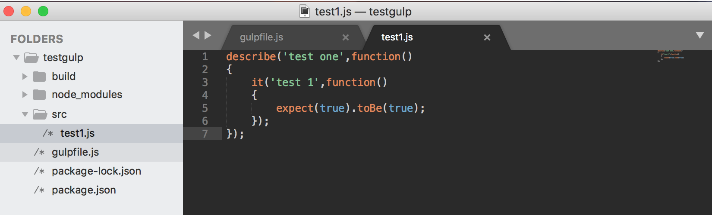
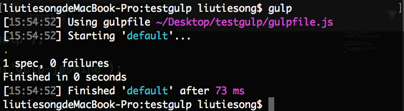
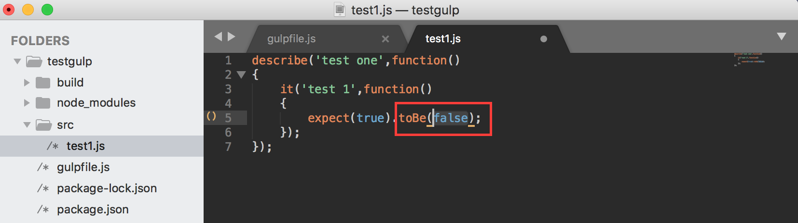
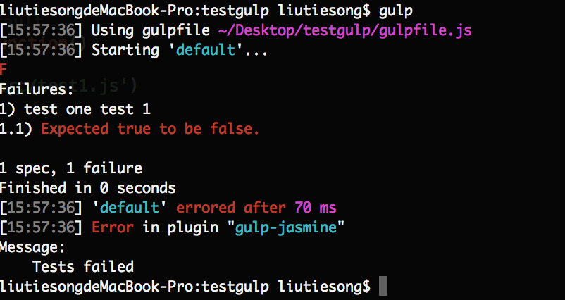

# gulp通过jasmine插件进行代码测试
[gulp中文官方站：www.gulpjs.com.cn](https://www.gulpjs.com.cn)

### - 安装配置开发环境

1. 安装配置jasmin插件

```
npm install gulp-jasmine
```

### - 使用gulp-jasmine进行代码测试

1. 创建nodejs文件代码

```
describe('test one',function()
{
  it('test 1',function()
  {
    expect(true).toBe(true);
  });
});
```


2. 配置gulpfile文件代码

```
var gulp = require('gulp');
//jasmine代码测试插件
var jasmine = require('gulp-jasmine');

//不带参数默认执行顺序default
gulp.task('default',function() 
{
  return gulp.src('./src/test1.js')
  .pipe(jasmine());
});
```

3. 终端指令gulp运行测试代码

---------- 无报错情况：----------

node代码:

终端显示：


---------- 有报错情况：----------

node代码:

终端显示：



