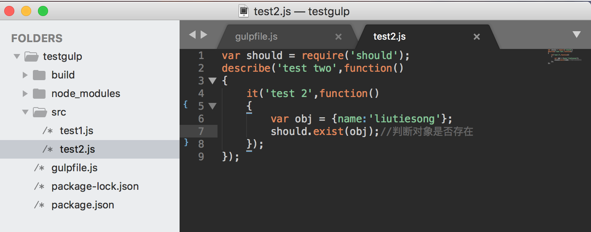
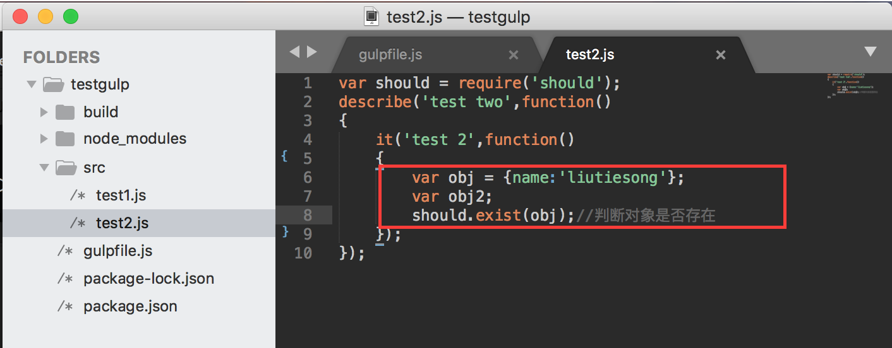
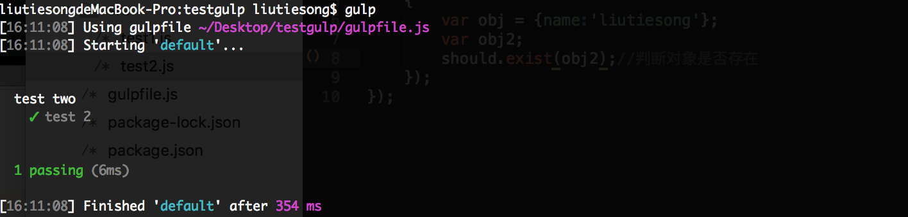
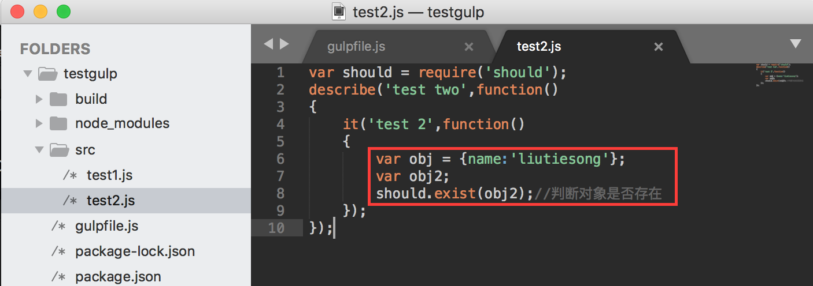
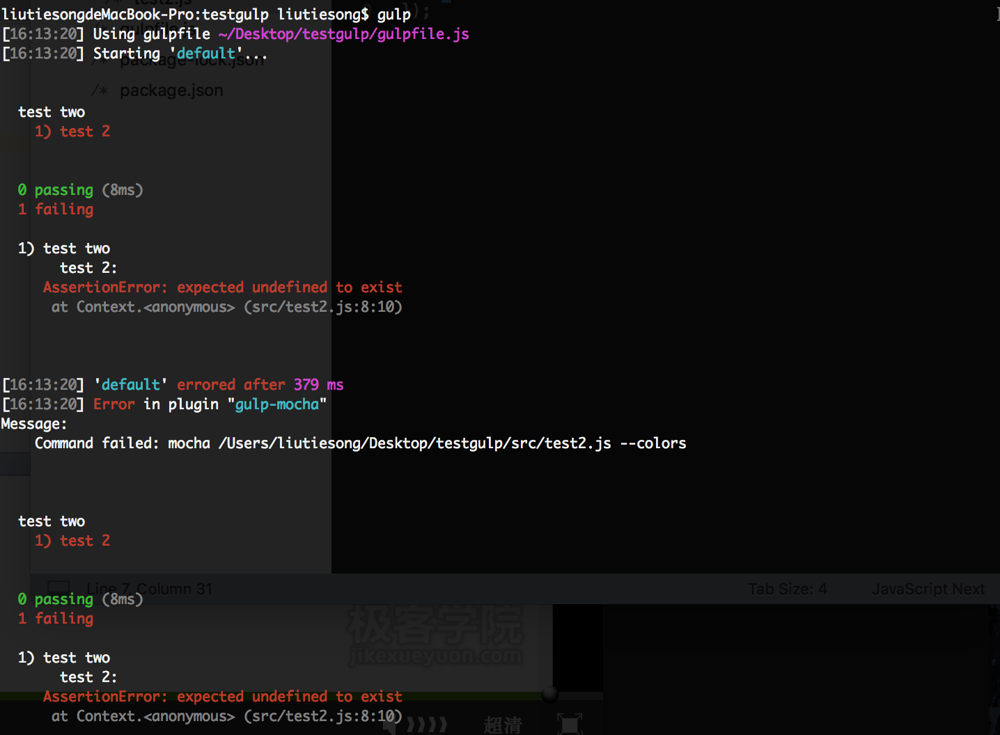
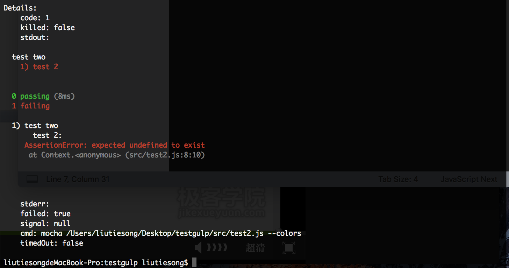

# gulp通过mocha插件进行代码测试
[gulp中文官方站：www.gulpjs.com.cn](https://www.gulpjs.com.cn)

### - 安装配置开发环境

1. 安装配置mocha插件

```
npm install gulp-mocha
```
### - 使用gulp-mocha进行代码测试

1. 创建nodejs文件代码 test2.js

```
var should = require('should');
describe('test two',function()
{
	it('test 2',function()
	{
		var obj = {name:'liutiesong'};
		should.exist(obj);//判断对象是否存在
	});
});
```


2. 配置gulpfile文件代码

```
var gulp = require('gulp');
//mocha代码测试插件
var mocha = require('gulp-mocha');

//不带参数默认执行顺序default
gulp.task('default',function() 
{
  return gulp.src('./src/test2.js')
  .pipe(mocha());
});
```

3. 终端指令gulp运行测试代码

---------- 无报错情况：----------

node代码:

终端显示：


---------- 有报错情况：----------

node代码:

终端显示：




