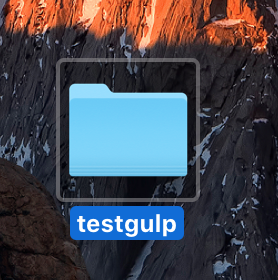
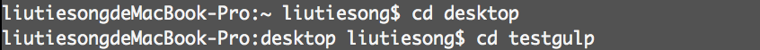
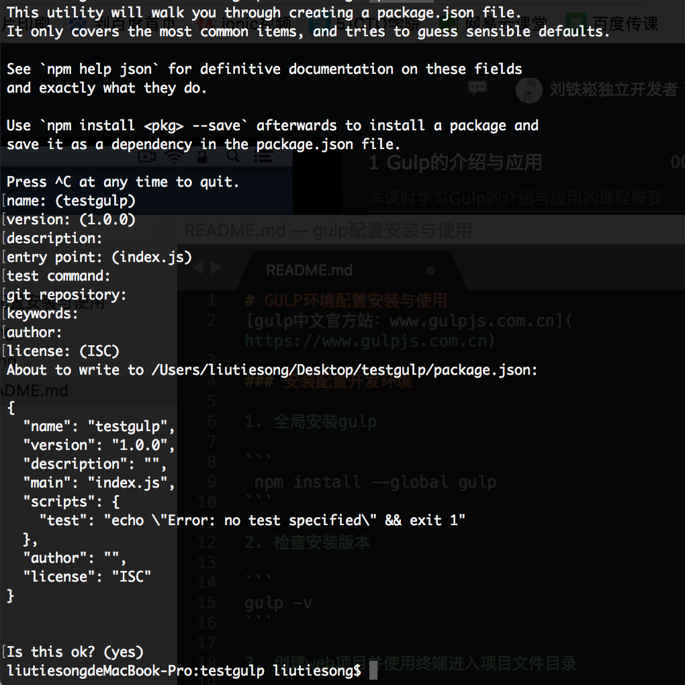
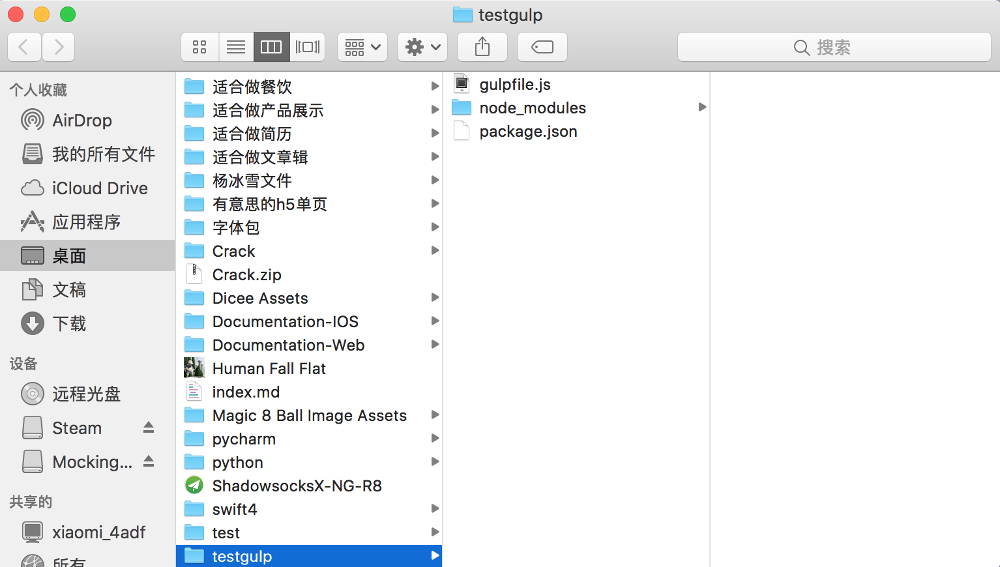
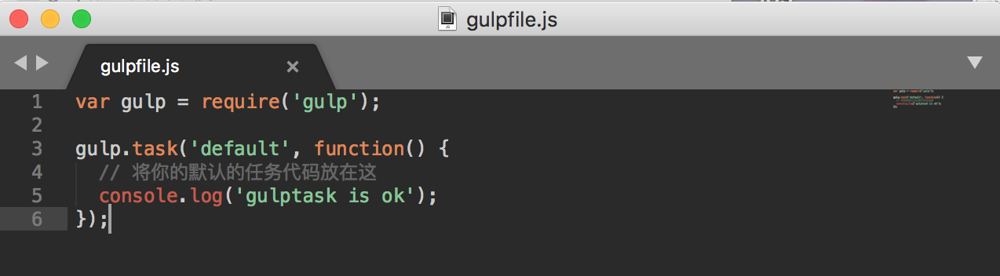
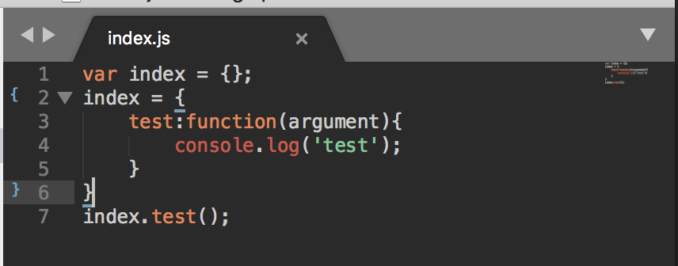
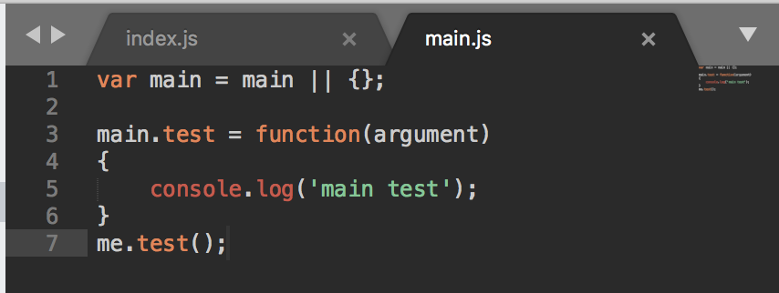
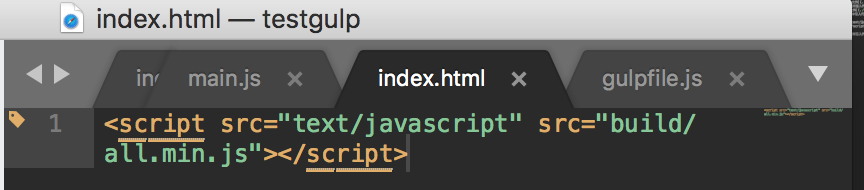
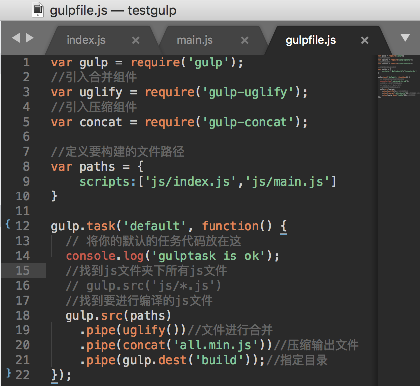
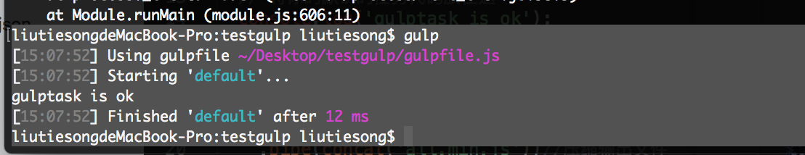

# GULP环境配置安装与使用
[gulp中文官方站：www.gulpjs.com.cn](https://www.gulpjs.com.cn)

### - 安装配置开发环境

1. 全局安装gulp

```
 npm install --global gulp
```

2. 检查安装版本

```
gulp -v
```

3. 创建web项目并使用终端进入项目文件目录




4. 初始化项目

```
npm init
```


5. 项目文件内安装gulp依赖

```
npm install gulp --save-dev
```

6. 在项目根目录下创建一个名为 gulpfile.js 的文件并且添加代码



添加代码到gulpfile.js
```
var gulp = require('gulp');
gulp.task('default', function() {
  // 将你的默认的任务代码放在这
  console.log('gulptask is ok');
});
```


### - gulp的简单使用

1. 终端进入文件路径安装依赖

```
//合并组件
sudo npm install gulp-uglify --save-dev
//压缩组件
sudo npm install gulp-concat --save-dev
```

2. 创建index.js 与 main.js 文件

创建index.js文件并键入代码

创建main.js文件并键入代码


3. index.html文件中引入代码

```
<script src="text/javascript" src="build/all.min.js"></script>
```


4. 编辑gulpfile文件

```
var gulp = require('gulp');
//引入合并组件
var uglify = require('gulp-uglify');
//引入压缩组件
var concat = require('gulp-concat');

//定义要构建的文件路径
var paths = {
	scripts:['js/index.js','js/main.js']
}

gulp.task('default', function() {
  // 将你的默认的任务代码放在这
  console.log('gulptask is ok');
  //找到js文件夹下所有js文件
  // gulp.src('js/*.js')
  //找到要进行编译的js文件
  gulp.src(paths)
  	.pipe(uglify())//文件进行合并
  	.pipe(concat('all.min.js'))//压缩输出文件
  	.pipe(gulp.dest('build'));//指定目录
});
```


5. 文件夹内gult指令构建文件直接到build文件夹中

```
gulp
```



