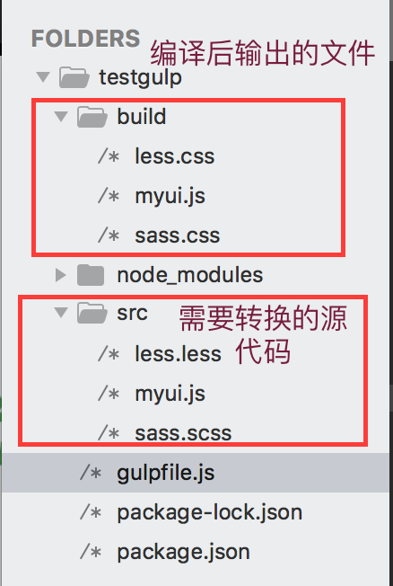
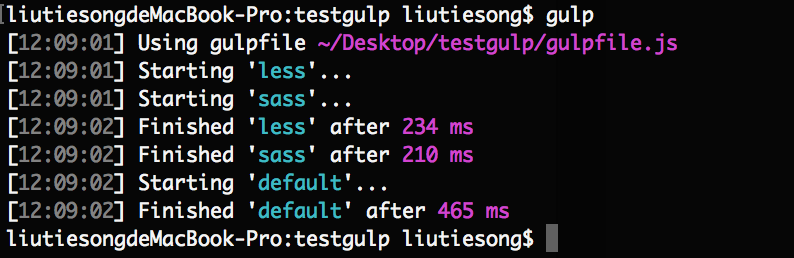
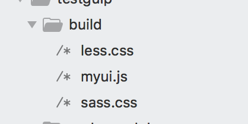

# 使用GULP进行代码转换
[gulp中文官方站：www.gulpjs.com.cn](https://www.gulpjs.com.cn)

#### ———————— 终端配置运行环境 ————————

1. gulp-react 转换 jsx 代码

终端指令安装配置文件

```
sudo npm install gulp-react --save-dev
```


2. gulp-babel 转换 es6 代码

```
sudo npm install gulp-babel --save-dev
sudo npm install babel-preset-es2015 --save-dev
``` 

3. gulp-less 转换 less 代码

```
sudo npm install gulp-less --save-dev
sudo npm install gulp-sass --save-dev
//如果提示node-sass安装报错权限问题去掉外层项目文件权限即可（使用本地npm指令不适用sudo）
```
#### ———————— 实例代码 ————————

1. 配置好项目文件目录与转换前源代码

目录结构：


myui.js文件代码:
```
'use strict';

const react = require('react');

class MYUI extends react.Component{
  constructor(props){
    super(props);
  }
  render(){
    return (
      <div>this is react , turn es6 to es5</div>
    )
  }
}
```

less.less文件代码:
```
@base: #333;

.box{
  color:@base;
}
```

sass.scss文件代码:
```
$base: #333;
.box{
  color:base;
}
```

1. gulpfile文件执行代码：

```
var gulp = require('gulp');
//react转换js插件包
var react = require('gulp-react');
//转换es6转换es5插件包
var babel = require('gulp-babel');
//转换less转换css
var less = require('gulp-less');
//转换sass转换css
var sass = require('gulp-sass');


//转换lessf
gulp.task('less',function(){
  return gulp.src('./src/less.less')
  .pipe(less())//less转css
  .pipe(gulp.dest('./build/'));//输出
})

//转换sass
gulp.task('sass',function(){
  return gulp.src('./src/sass.scss')
  .pipe(sass())//less转css
  .pipe(gulp.dest('./build/'));//输出
})

//不带参数默认执行顺序default
gulp.task('default',['less','sass'], function() {
  return gulp.src('./src/myui.js')
  .pipe(react())//react转js
  .pipe(babel({
    presets:['babel-preset-es2015']//注入插件包
  }))//es6转es5
  .pipe(gulp.dest('./build'));//转换结果输出
});
```

#### ———————— 执行结果 ————————
gulp后执行结果：

文件输出到目录：



