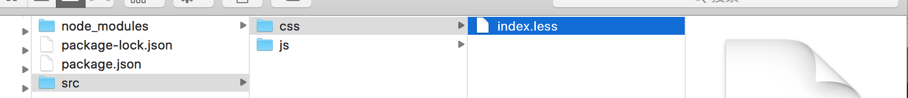
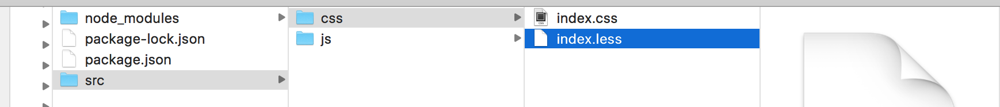
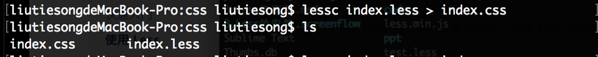
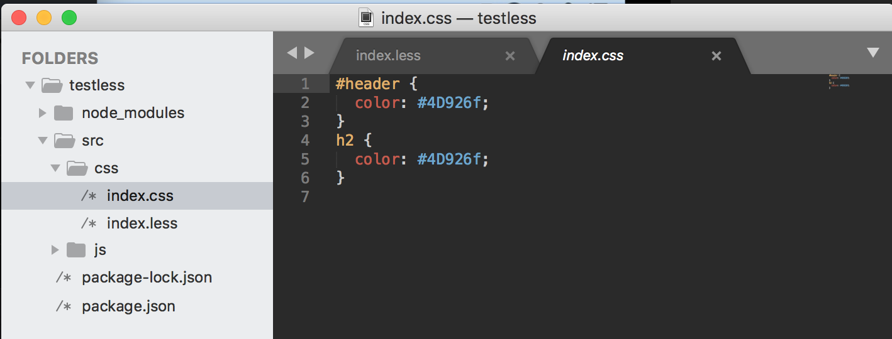

# LESS的环境配置与基本使用
* [less文档](http://www.bootcss.com/p/lesscss/)
* [less中文站](http://lesscss.cn/)

### - LESS的配置和安装

#### 1. 安装配置LESS环境

```
npm install -g less
//或者下载最新稳定版
npm install less@latest
```

### - LESS的基本使用

#### 1. 变量

- 编辑less样式文件(index.less)：

```
@color:#4D926f;
#header{
  color:@color;
}
h2{
  color:@color;
}
```


- 使用指令将.less文件编译成.css文件：

```
lessc index.less > index.css
```
- 编译结果：



输出代码：（index.css）


#### 2. 混合

可以通过封装类进行使用
- 编译前 index.less：

```
.rounded-corners(@radius:5px)
{
	border-radius: @radius;
	-webkit-border-radius:@radius;
	-moz-border-radius:@radius;
}

#header {
  .rounded-corners;
}
#footer {
  .rounded-corners(10px);
}
```

- 编译后 index.css：

```
#header {
  border-radius: 5px;
  -webkit-border-radius: 5px;
  -moz-border-radius: 5px;
}
#footer {
  border-radius: 10px;
  -webkit-border-radius: 10px;
  -moz-border-radius: 10px;
}
```
#### 2. 嵌套
在一个选择器中嵌套另一个选择器来实现继承
- 编译前 index.less：

```
#header {
  h1 {
    font-size: 26px;
    font-weight: bold;
  }
  p { font-size: 12px;
    a { text-decoration: none;
      &:hover { border-width: 1px }
    }
  }
}
```
- 编译后 index.css：

```
#header h1 {
  font-size: 26px;
  font-weight: bold;
}
#header p {
  font-size: 12px;
}
#header p a {
  text-decoration: none;
}
#header p a:hover {
  border-width: 1px;
}
```

#### 2. 函数 & 运算
提供了加，减，乘，除操作
- 编译前 index.less：

```
@the-border: 1px;
@base-color: #111;
@red:        #842210;

#header {
  color: @base-color * 3;
  border-left: @the-border;
  border-right: @the-border * 2;
}
#footer { 
  color: @base-color + #003300;
  border-color: desaturate(@red, 10%);
}
```
- 编译后 index.css：

```
#header {
  color: #333;
  border-left: 1px;
  border-right: 2px;
}
#footer { 
  color: #114411;
  border-color: #7d2717;
}
```